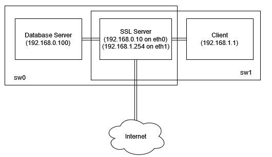

# A09 BlingBank Project Read Me

<!-- this is an instruction line; after you follow the instruction, delete the corresponding line. Do the same for all instruction lines! -->

## Team

| Number  | Name           | User                                  | E-mail                                        |
| --------|----------------|---------------------------------------|-----------------------------------------------|
| 110996  | Diogo Pereira  | https://github.com/diogo02pereira   | <mailto:diogo.m.pereira@tecnico.ulisboa.pt>   |
| 110846  | João Matos     | https://github.com/joaorsmatos02      | <mailto:joao.silva.matos@tecnico.ulisboa.pt>  |
| 110947  | João Santos    | https://github.com/joaogoncalosantoss | <mailto:joaogoncalosantos@tecnico.ulisboa.pt> |


  

## Contents

This repository contains documentation and source code for the *Network and Computer Security (SIRS)* project.

The [REPORT](REPORT.md) document provides a detailed overview of the key technical decisions and various components of the implemented project.
It offers insights into the rationale behind these choices, the project's architecture, and the impact of these decisions on the overall functionality and performance of the system.

This document presents installation and demonstration instructions.

## Installation

To see the project in action, it is necessary to setup a virtual environment, with N networks and M machines.  

The following diagram shows the networks and machines:



### Prerequisites

All the virtual machines are based on: Linux 64-bit, Kali 2023.3  

[Download](https://www.kali.org/get-kali/#kali-platforms) and [install](https://www.kali.org/docs/installation/hard-disk-install/) a virtual machine of Kali Linux 2023.3.  
Clone the base machine to create the other machines.

### Machine configurations

For each machine, there is an initialization script with the machine name, with prefix `init-` and suffix `.sh`, that installs all the necessary packages and makes all required configurations in the a clean machine.

Inside each machine, use Git to obtain a copy of all the scripts and code.

```sh
$ git clone https://github.com/tecnico-sec/a09-diogo-joao-joao.git
```

Next we have custom instructions for each machine.

#### Machine 1

This machine runs a database server that connects to MongoDB.
Ideally this machine would run MongoDB locally and not have the need to connect to the internet, however we were
unable to install the database locally, so the network scheme had to be adapted around this.
 - Once the machine is installed, run the script:
    ```sh
    sudo ifconfig eth0 192.168.0.100/24 up
    sudo ip route add default via 192.168.0.10
    echo 'nameserver 8.8.8.8' >> /etc/resolv.conf
    sudo systemctl restart NetworkManager
   ```
   with<br>
   ```sh
    $ chmod +x cmd.sh
   ```
   ```sh
    $ sudo ./cmd.sh
   ```

#### Machine 2

This machine runs the main SSL server.
- Once the machine is installed, run the script:
    ```sh
    sudo ifconfig eth0 192.168.0.10/24 up
    sudo ifconfig eth1 192.168.1.254/24 up
    sudo sysctl net.ipv4.ip_forward=1
    sudo iptables -P FORWARD ACCEPT
    sudo iptables -F FORWARD
    sudo iptables -t nat -F
    sudo iptables -t nat -A POSTROUTING  -o eth2 -j MASQUERADE
    sudo systemctl restart NetworkManager
   ```
  with<br>
   ```sh
    $ chmod +x cmd.sh
   ```
   ```sh
    $ sudo ./cmd.sh
   ```

#### Machine 3

This machine acts as a regular client.
- Once the machine is installed, run the script:
    ```sh
    sudo ifconfig eth0 192.168.1.1/24 up
    sudo ip route add default via 192.168.1.254
    echo 'nameserver 8.8.8.8' >> /etc/resolv.conf
    sudo systemctl restart NetworkManager
   ```
  with<br>
   ```sh
    $ chmod +x cmd.sh
   ```
   ```sh
    $ sudo ./cmd.sh
   ```
  <br>
Client application config examples (args needed):

args: ```<userAlias> <password> <newDevice(0-false or 1-true)> <deviceName> <account>```
- Alice account: `alice alice_iphone 1 iphone alice`
- Bob account: `bob bob_iphone 1 iphone bob`
- Alice accessing Alice and Bob's shared account: `alice alice_iphone 1 iphone alice_bob`

#### <span style="color: yellow;">Note: The application runs with default users (and their associated files) listed in DataBase/initDataBase/plain_text. There you can check the default users and data associated.</span>

## Demonstration

Now that all the networks and machines are up and running, lets execute the application. You can check what is happening in the Server <-> DataBase after SSL handshake.

```sh
From: DataBase, To: DataBase
Message: Starting database server...
```

```sh
From: Server, To: Server
Message: Starting Server...
```

```sh
From: Server, To: Server
Message: Connecting to DataBase Server...
```

After the SSL handshake, Server needs to send his Certificate and the HMAC of it to the DataBase.
```sh
From: Server, To: DataBase
Message: Received the Certificate from Server: [
[
  Version: V3
  Subject: CN=Unknown, OU=Unknown, O=Unknown, L=Unknown, ST=Unknown, C=Unknown
  Signature Algorithm: SHA256withRSA, OID = 1.2.840.113549.1.1.11

  Key:  Sun RSA public key, 2048 bits
  params: null
  modulus: 25779561905750510373419739059923559439627324708376322507804615103656903684569011864142545713836950421022896468440624800814235386749694890437106289350239420807056843598248641935271009646711475698826139649251736500847597861476501688109619588444329015038214742466499696343219011900786134810491528012291032559463539862529050448481783377694412041041072373390793364908581421164275756518358247663142330564168137475770981865610115204366077708321885742174381614555072097086988198379586260131691795591933940553824396324788464997566125132257782538476376089969164708118951553811166150270067683299226459913072568510259882294581757
  public exponent: 65537
  Validity: [From: Sun Dec 10 16:14:43 WET 2023,
               To: Sat Mar 09 16:14:43 WET 2024]
  Issuer: CN=Unknown, OU=Unknown, O=Unknown, L=Unknown, ST=Unknown, C=Unknown
  SerialNumber: [    20beb20c c77b51d4]

Certificate Extensions: 1
[1]: ObjectId: 2.5.29.14 Criticality=false
SubjectKeyIdentifier [
KeyIdentifier [
0000: 42 13 9F DA BD 59 1C E6   CC 00 F7 76 81 A2 7A 2B  B....Y.....v..z+
0010: 4F DE B8 48                                        O..H
]
]

]
  Algorithm: [SHA256withRSA]
  Signature:
0000: C8 54 95 93 D2 9D 7F 73   6C 75 F8 63 FC CC 98 9C  .T.....slu.c....
0010: 5D BE 3A A0 00 07 BA 38   72 33 C4 C4 20 30 36 50  ].:....8r3.. 06P
0020: AE 8F E3 D9 2D A2 95 AD   A9 0A 5E 99 1B CE 76 CA  ....-.....^...v.
0030: 0C 8B B3 A4 00 10 62 2B   99 5D B4 CD EA 1B 20 C8  ......b+.].... .
0040: 99 23 AD 56 E1 FE AA 92   DA E3 32 08 37 03 2B 03  .#.V......2.7.+.
0050: 81 45 22 D4 3A 7E 5D 19   79 E9 F2 6A CA 7D F1 F8  .E".:.].y..j....
0060: 53 E9 E7 6A 3F 25 CA 64   93 D3 68 8D 04 80 A2 38  S..j?%.d..h....8
0070: D0 2F CE 2E EC 19 AE D0   C4 77 EC 40 70 A0 A3 CB  ./.......w.@p...
0080: 70 18 6C 59 2C E8 F6 50   C4 7B D0 99 2B 6A FF 10  p.lY,..P....+j..
0090: 50 57 25 43 CF 28 35 CE   7F 6B F4 43 52 18 22 F1  PW%C.(5..k.CR.".
00A0: B5 58 AE F2 EF D7 24 31   76 D5 48 F7 9A 9D 50 3A  .X....$1v.H...P:
00B0: E8 5E EB 1E E4 C0 62 8A   B8 53 D9 9C EB F3 33 3F  .^....b..S....3?
00C0: 0B 78 11 8A 0A 55 D0 2C   5B 10 5E CE 0C BC D2 09  .x...U.,[.^.....
00D0: BA 6D 54 49 7D D2 27 98   36 BF 8B A6 BA 82 22 A2  .mTI..'.6.....".
00E0: F1 B1 75 13 0D 68 4D 38   E3 89 AD F9 01 9D 31 57  ..u..hM8......1W
00F0: 69 8A 21 1B 55 5C A4 57   82 1B 1B 77 5A 39 0D 0E  i.!.U\.W...wZ9..

]
```

```sh
From: Server, To: DataBase
Message: Received the HMAC of the Certificate from Server: [B@7231b9f9
```

```sh
From: DataBase, To: DataBase
Message: Verifying the integrity of the Server Certificate.
```

```sh
From: DataBase, To: DataBase
Message: Comparing the Server Certificate in DataBase TrustStore with the received one...
```

```sh
From: DataBase, To: Server
Message: (Authentic Certificate.) EncryptedAllCorrectFlag: d/kqusBXPfwT1b57fOTCPjBJ0ULKg2K0ZarH+6hJQrI=|KQRcSu31uwc0uJAAHqyu1hEINC5bPL6RFZsYK7xu5a4uzKYblxruCUlGp7Nw43wdiqRGNPmV0/+/UV2mK5yq/Wn9E8Ulv5BTJux9F+o0owucZsNvJ6Kpx99YIQy8vN3zDmIO1JQgqV1oLnWzebWYT++D+4jprh/x+BYuwc1qt3ZVe0GXWorG0IOZuwLEdxC+AALG0p8CvMTGvDxCHvfSv845nsFDnhtA2jC1mfF4HGQz2RcCrW9Kwo2whSdMTnMKh8vKBYArlsodg84qtbWdmUTXIiK07wG6X6ma61ac1njmrEKiHbQx0M3bIdtgJSxozpyZNUhUZh8ftNw3iMYQxg==
```

Now that the connection is in fact established, lets access Alice's account.
<br>(Run config: `alice alice_iphone 1 iphone alice`)<br>
Since the new device flag is active, the application will execute some additional tasks, we can check that in the Client output:
```sh
Starting client...
RSA & keystore generated successfully.
Certificate added to the truststore successfully.
```
 - And a similiar Certificate exchange process will happen (not showing again since it is the same process as shown before).

--------------------------------------------------
Now let's explore the features of the application.
```sh
Welcome alice!
Here you have the list of commands you can execute:
 - In order to see your balance, write the following command > balance
 - In order to see your movements, write the following command > movements
 - In order to make a movement, write the following command adding the value and the description > make_movement <value> <description>
 - In order to make a payment, write the following command adding the value, destiny account (alias name) and description make_payment > make_payment <value> <destinyAccount> <description>
 - In order to see your payments, write the following command > payments
 - In order to see your pending payments, write the following command > payments_to_confirm
 - In order to confirm your pending payments, write the following command > confirm_payment <Payment ID>
```

Let's check Alice's balance:
```sh
$ balance
```

The server should respond with:

```sh
$ Your balance is: 872.22
```

Checking the log file we see that the message transmitted from the client to the server was:

```sh
From: Client, To: Server
Message: EncryptedPayload: fKk+jG3lraXuA6GWLg1+517dnhXCMyEDCa4uE4/5j94=|DRwae2HGZZ/gMHi4oTaVnunl01wNGEE7rn1CHMCTL+ZBlai4d5oM9Pn5rHyBvA2jtAFDyDiBzP0m69vpXkUd+uw066Dg/RfuYyfareDWWHsz6lmSgxgDOeBghDhowXatgOajDzi57y5Kmqo9xOzoqJB10k1Ohe/cx1TjN0vT0e0w1w0upqbGzpHqYzhXgcNDAs0U5VKP/4n0sXd5xIxxqtDCjXPbQPR1WBKKq/mgIn9DdtQI6vXiggu6XXjxIAA0KwpzPISIqBbjAnxrx+bL5qHGUBjfDehG89pmlf0HTS9SvnpIGi4thjgiwmWhwsHW+AURHN56kJj97n8Q0DScaQ==
DecryptedPayload: balance
```

And the server response was:

```sh
From: Server, To: Client
Message: EncryptedPayload: 7rCQnkoaoDuG6BlMX+0/pTDumg5AhUt9hgL0jSlk8ZY67ENhxEz9LV2LKdWThFMG|G13jlub9upcvkzZ3cLC0wKmH5MC0iztm9uzPEpFk8u/0Kllgzheb8JbifpXopeB748zsHwgIc3126gBA+Nv1hTq/hAKMMq4ddSg2y5U7Zp7+aU5o6DkOt5W9FLiJT/d/CfJRUzJJALEAyo3Gm5JxbBcnWuEO13ZutFmdXL4WgdNGNWikN5jpJXZxh87m1rkd+FzOnIj2k++kJPYQa4AR1DGi8v731vBbChgF2U7Rtn/i0a/W2w1mzQW9uyez+rRVTc0q8jeGNtsrEg37hWzoyt/jQB/AVd0CmX3nZg+Vwh95eHGogvrwAMSn9ao2Y3cCy6daZTlgyz2rbbFS33ZrFQ==
DecryptedPayload: Your balance is: 872.22
```

We can further verify that the information was transmitted from the database to the server (and vice-versa) as follows:

```shell
From: DataBase, To: Server
Message: EncryptedAccount: f3HL1LyJ+b0Vx+5lBjekxxhKhE0GFC6x5JlvZHapDuFtocr98dYaTCHN+3+rPF59gZTxZnRniATDCcATiK0UBF6nQ5fBK7cF8ufU12ljDiHzz9Wmzb6AXMWMf9oHdL/tPomIeoWtSy7Dye6V9TpL7VgEQyXLbGkTYQ36yh08iC1UfPZDpUi7XuSsqsVNfonaDFKVnOREIM7URNL+iG+zq3kT7AxGmf3YYmxqJBdjFKVplxx1u15n43nLVGrZN3UX3r8O8iEKCgplnDb4Mif76S0jewwvF60H/Nm86wjhx52uijgiG7OO9B8FzbjXzDMIP7a6Aixi/2xwCYD1PwZ0gWTDNAaTZ9KlQGRmyh9W76r1XTYux65QeZTwVZvj7sPa0Wy0ubV7W57KCDYyZzdGmUqUexpOJ0YtVEkIV8Z6emd4Hq1oceM5dhpFrdKo8Hmv66PMCaRWjIu4ptuWI7wki1Lz1uiZZvgHMuRR0aEZ6uwls6Nx/3y4fD4xIh6Fibo0eJeIXl0CfXr1DmjtqO/GOPo0bhf34ACB06O1tTCi/SX2AQ3jySLcL3iymqN4SFYzbvCidnv1xScrc986GYvM955LmY7pUvYs4fKCC+/SnXk/PbBwqzFIiLnB3I86jj1I70ydxkJyzo2Bjw2URicIiHG53260YsNGVzmbRHb3clgWIVCzZOMuzdMqPAERF3reFQbeHcBudaeEpVttPnaLYATV2U5v2trjyGr/xMa2L4EXvIoUWCngExD8Di/7weMCqJaY9GhVT5kO9kUavMuyxkic9ZdcXAPLiTqn9AUuk5PFlkj+vTnUSzB7ovppAY9lbzvbI2n8KA+XZi9z5LaWvoSjEpKjopX4kxqwmFx0OmkpX5WtA24hbifmGKqgwpZvlCOdlC2sc2iyEErOcB+X1l2rmUTVQuCqA0YN7EZnZwrrffcRvZ4rIqibvo4pBZKa8ujSOMUi6TUg5X87DazbkOQscImUvbsGV+PXg+s1FMKR4KwAlqX2DuPVj3numUhY8AMdTfjmhs1fJB1DaemSv/BtC/rAHcowxlkZBUU1qJ9JD43MjJjSABD9Ui29dChOrCwXdoFbYr/7PfCiQ+SMWOVqPhupmVf0aegkzl17g74oKODnDKx7Z4UsY9vH42R4n4c3cr3nEJVV2/0kok8pCbg0oYxLkcI7n8QkxT25Ce/w9cGDZ8um5XTyPX4JcQnPZe60qDpQPBmWPxQm3THGq9Ok6YLb7KKes+SP1Xpqya60HgHXYs4ZtDIl7hWhTcVp/j4LcjrzFecU3AbONfh0X+A7tz/GzZF4OVcr9zXWFwxqgLjO24JcE6Zt/87dPU26E3Ikpl39YITd5vLl5KRNK9yWt5UUHOwRW2O158Tu96ljH0YaV8XrmDWvU0Vi6m5/99AfH4SaDhRuDKBg9romKh4zJhs8rdv1RhT+43zysQkkMLUuFweW+IoFGxnWRmIZI8YsC6hrzRBgNOc8UwBkVHJRZE02aclIE53ASyrKcGgxRUwzqEDQv68ait+bytmlFQrCcgnRufkzYdYlOPNDB4kpGWNvGQil4D90ii09afqNDx8MYsopbG6kAyb1vIo+MkSXAMbVZbHWptlTHXT5U4bUmzv35YRvjujeG6rQVNbJg/phZmlg1doLx1FL9SvsCMkhiHkBXeRg7n8xmb+gK57GJP83xSYr76X0ZV4E52W+qETTQSu3UEd155RNU64K3eOsI9SxedVUaUf3i1OH12whCQhTA0YTInqfmcQaTTCgt4JKFxja8HPnq53QJtboXXtSFKCDUGwshqgJ1e0jOqdRTbdqDj8/N/e2qOjuo5Agz0pQLY7i0GhOb8Dy2SCFKZgSqNTpZqyGOca2OK9hNNpuPkq0FdDsEyyKOPRhDUqmra71L+QRPEkGjN6SpATBAloxmvTsD94aisJiAL6tVVt5FnyOHZKJH56jJUaelxW62NbcI7Eb/pLi2v5VbVD9xm4P6if7cPEIu0V+wlnMyNqp9wGsukQy1a9mULzdyuXHOiJwCNHW8hkkCsu7OnIdSDMCBHQizlZS1/TO1r+MfdpoIvXCC53fGdlJuVw/NHIPYtJXmTNcBH7uXBC556tJGCyy0xykwTdnzyHr1MlgiMgBMDhzhHcZutw3spE4zti+/wKwQ1WesPEElPjXmOB5p+K+aZc6CfKpFFF7T9N+VcSd+oa5LeoXrySgj4RNZz4n5Idf1d00HBPD95A3FlZ/wZS4+oKx713ygjaqHM9VDBblqyWTskiq6LjxmL4c+PH+Im8qfEy7SKw+aOFQ+w1h+4pu5YuO1bUTNmtzDa+lYF/EG5Ins1Dlz3OL29VUTpdYJzcyfwP3KzfM+nQSse0Px3NqPBF4w+d86MBzTFDnCE16bFI9wY/pV/D4vP6g0pl5v3i5yac5MPF9FGNpgh2Fw1V+Xnfdxj9rSXAEghDTf+JrLOCOakrX6E/QZvGTvTjL81GRVlKARCmos1jSISIm+ju/hhoE952v03e/GSGM9AFYptiKmE7SGOdet/Yg7Juaq380l5IvrXw4AK6/QbKSwI+OGNGM4X6gqGWvj85Ie5/8kLseRqztB/sIv5PDZC07V9Q+bbJ8HGCnSo+4GAS4Fr0zSPQhLeysm4IoLu+tQQfQKssh7DrHR6YgTHQpTTEDBGL0L9S/qxWEAKILAZFA/PvktjXwprLwZJwK5+5PmwRCWNGEctIeVO3wOlniIvOpGVMf9AWX4DsZj+oNYjceRMkl8/zHp5RpJLdAWJXw3UDUROx9OCXWYb8O76EkCqo/3Fl1b2du9RbKOTYQh6X869AkKJiijNLdqAAweXKanRQevhgnIY4BGLiRUSmHSZQf0SXQX2g548MCfxx8mEJ0icIKEVBVnNxqwzy1gqv7wKzKqavuLuD6EbJUW5a/6Cv9Pf1L/HwzZizSoQfugQnGd4pPpNYSRYyQeLl3d5JaQbJBorJ9FTItaZnuuwOTlj4roOfGcA9UUGOpwB2O8AC0hCp71O7aHwxBQbSQMYc65D7ZzGcgZFdPYJ8D2VFfOEw=|XVywpM3WhRZu4LLAwN1GDsHNVCJFNijFzvrkICtA90Ct9Df3SxRfgehNYoBi02WQyR2zYwnyr1GWA6J3GnywpkiF5XL0siCHjOx+LjCqZi7Kd592mQdsPTFhjPaDSPCXLtLhUBFPWu/3t4ZpIKHLALC42EEcdrZjtVF41CPGADHxXDgJmX3lo0jPjzJLrSaLwVM+LyciDWk3fBXdIwqtkCkk442FOuCtat/cAskw21wzK6tV6ATGxP2iEOFX/geUVE3s1uFsRqKI2UamiCKwIpNjN+riWhjVesPQwkIKj+ihIhoPQjZc3DXptyczQQkwWhJj2jd04dGEOuWwnkUrLw==
DecryptedAccount: {"accountHolder":["alice"],"balance":872.22,"currency":"EUR","movements":[{"date":"09/11/2023","value":1000.00,"description":"Salary"},{"date":"15/11/2023","value":-77.78,"description":"Electricity bill"},{"date":"22/11/2023","value":-50.00,"description":"ATM Withdrawal"}]}
```
```
From: Server, To: DataBase
Message: EncryptedUpdateDBFlag: P0L+icmErPMFTC3xspgxN+MoFkn4Md/bfejre5MHzjk=|nhPG+BVcnH8DnXdj6WmceeOGLiq9earhjiUgsXmZt2pYlWbYc1GEpX8Y6yI3mvwENNkh92UpvA3w/OPhXIOJNLVWkPiRQM8Kjo23ZKVqw1gtw0d4gukuwfNORvxxhQxgLOvUVU0/eP6gYtEnnXvnpBSGvals+d4Q3E6JEfgT7V9G1iPRNJ53OQPeRlzc5fFUoVjblwxAS+B97MuwwwvL3kfA9AlcL3rloxzVUiAa21w2a5xZIGDG3ugb1zgnL3m3RPn91iIXaji0FW1759rEQubc0R4KxKXStL2diq6slgjOK+gNcojkpTELOT66xn2E4L62Y/OS0cJvySLbTiSleg==
DecryptedUpdateDBFlag: 0
----
EncryptedAccount: jnpnk/HHs40Y39qR2lK0P+D2Vk+biIAkHDy5Otkzx/I=|tmwyKS/PPKAzniNbPqiPGw4aHUIcjyBNprvBjmftFbAsJrK8uHSnsrYfPsO/+DLCMyC/ejiYLZTYRArtNUhS4Y0p/LCmdfDPsHGSodtZUcUMwxrbbzbsBygarMH9qhWNOAD5G5VXhJi/pPuH0mWcc3nsX8D6/tUDwhcfC/Gmvx8xdqUZ3u7TAP3NQSi9/XPT04vPiSeIq6V/axfqh3MqNF4ZqUz6WStmrbp6ar1XbP4ntoWNiEmvS78X/viV8m2NOflkQp3SotLtQI+5PjQ8Al3yd2aNl2O4bp4lMqqBshiztiOYJLJnL+EzNgxhrmJfEj20fm7NPgDF93A59FPkpw==
DecryptedAccount: alice
----
EncryptedDocType: YO3oTKdaKalzsVmTe+sWv0+4GFfkrya4sKCw/N6pqM8=|Q5ME9GYTKRCFB/SHDgTalQWZAQ6jZf6BnOXsYutjwBH915NqWTqWS7Jan94e9hn3bzvKXlg3+JWH5xqsvgVvH74a8VqpOufTvJnqUftZwFZ69tg19N5kPUEHyAvqEubSQFqD1IfmedrJ/N4cYvM4x3nI5D7fr/2ponFuVHGBv0dWuGzK5y46KVUTOR7qMkg9CzmkHl5SVCDiaI0mFmsxkOX+VxviQfuuTuCq75qAnVBtbc6HqNqUkSEXqFsPMfEZdHBCbRvzTpO7znmthcwvJGr2YKb8I6nvtqDJNXt2c3X5nORP/Y298HQYGGF/JIIl7oqQLEcHHIbP6oTtlLQDLw==
DecryptedDocType: account
```
```
From: Database, To: Database
Message: Account option - Get account query.
```
```
From: DataBase, To: Server
Message: EncryptedAccount: cvrk3olbLDJPmFuKDairnXIyMzuAo8hNu/bJzBN8jCqI5SamILx1Qail+wJ5KEQtv/lvAZg0w5cfeP5hGPF5//mqbwXuuFEJYGkXE7bbSRvihiqUSx+iSxe+YCUCnZxO34rHMp1WiTYCvWMkoj/wmcN7+FELOmBrlAPOWr1m52oPe8P2CyohZm2NJIL0igmwadNpo70vXEuwh1FZcIKDPDTybGoWF/QFPI1JcjIf8rqJFlAWLpn05n648koWYE1p8mJP9eDGi/4uF89+6jhHlvZzQHjUQSLsR7/tyAekrtrCiu19MPcFHeYIwjUWGYWyqLRUOGndmUEuB6h+R1bCmbM0MiCOMvJR1F6WfNlAlwb4WfqKc0iCUlidKxd+nv51Z9LUPZ9muFVhX2kAzyB5bJ/TdzaxPqqut1nt4odKApOWdFNc8BYLhgds0EWs963ApcvxezEYwx3n+fMRFNlbwkv35U9PqsO3q4o4BJJVkAp2270YOK1NIsBqHC++iF+1sa62y8nJFTD+6dUfUI9YNc7VRAcQKyMYmaNoVcl/vcx6afScEZ+EFR0Mvt0wBweMVJ+w5ND75v4z50el3x3uEwf2spMkvSMW9SYPEc6F7pLHNrPz5oZ7CjVuCEFRaYJqHJ3dVgHuBuJLM/e2HMWN11g0O4O0uEvMWs7DOmdObvcNa5goA7KMsm0lorqtC9EEmkxDW+C9C8HaPbPJm9ruPPSAwStJQolA8OFWLP+oJ9jxcGuwGj1fIZJSFJVaRloDpai4MrMbjNXh8isUXaPdlCiC7COt58G5GjCAOsPK71vxKBv868iWBFkq3HXqsWVw0BApueotDx3c1UhpO4mCHpILjzFsqoYciEZer6H701mKAvMPv+UTEuVQM8rR2laAHEX51BsYokbvjiqnbMfSoyoHC+nIOTepGZZw8DIb1PhQAr5fHcc4njBAdud+fYdJKAyM8sMyVJKdh73jNXoTTRd8ySr9Bg4bLvODIERmPT5xf5C2/9APxb4Qo8s+2j5vpk7fDkKo5xzPOWsDo0t4ELZ0AbwnVvlh8Jj7hzSftShPUo/A6kJm174RayKSNJ+eJoa53TSIvYCbPfdikqyo6Io5VJWXiY0HbMCXiCzw7ZiCtCr+gz4HpKixMq808+lE7rYKiVmisiketDkijxbh+CGBsT3LPTmYWzdgGGmSweIvtkCrZenapZ4VELXpFjpOvpCzdopVu5gpt+VzW04r6C2hBRO+XOqoo/WVyxC9QC4BqSQS5rKYIEuvEYhMg1+hFjHuoNtY23sXGzXk4K5L62XFUq2pdZ1cTz4Ffs3imztdM53Db77yQEK47dERM9w+ndb2XisYkaCsha2CSfuPRRymAzrpwXPG7fLFPRQyRD2y4A3NNLAMogD5bYPWEFCgKJAki83jbNXWaPwrvOgY41EVk5aG2aidtRSG8TRRJgn4/jD8DfIPMTP/hZvL0LaD6QJHHcDVsk20eEtXkVmoyMiqYAY0GkwFZmT3wkfzDsS0/Tdlaz4lXQRKULxSn3oGukiZac3/B4epsUGOz7qPhQBndwhVXAZpvH//gfTVE3gvRN15z54VOcCRr9PN/7NK4m0witTwcBGoChiyOC2ahItWEvnek9qR1g3xYQeQC8ah/ecLtp5MmyC2RscKWxk4x/9EkuxAhhPLFoM+uqdh7kYh32SzG6b89CWW8mcw8ana96qQNFxZF0U5ubcu9EWt/a/W+759u1hsabc+R57Z9dOm8wvOJMEkiKsWAQLSqPLT+z0TLqTkmTk9KvPqpAg8OzHlfWcPh2Yz8q0N7qKNTjOktL15coYUjvaDFBwEB2oNvLuixZVy4RD6n9BM47CYAmYpXrW40kMbl0+6n0IlKVNR+HDMXKGm7msop4vsCmaNiHqUjKWymNYWKmU/zUiAdxyW36pSXkp30i3hALDny7oj+ENQ4Rb71mvxgBCqS0GH5vwoN7SbolQnwBsm8+/Cdwqc78DEe8FJFqL4NIgk8eBFI//SXukKAtN06uLvFVG6as8lQJ+k5Frbqx2WDlLnweV+A/uJGQtPbzYtbhrqeWAtA+Co4k69uE8q54P9fxnUSV47D2haFRHWy9Os0f6L6kZ/sUZq7TEhT9T1Jo6TcfZO6A5kXqmh5ScX5gkxdWvGB1hkYhQ3vwI/rtiaAJxUvM3P83IWV9Cq6zl4FBY7y0LGHX8VZ+Tkv7dqHKQ35+OEoOSL1aGbzrcliXAg0oMr2iYcYvJ1EXwziWp8UJTxuQm7+QCYnwvm/fLwCv5IPi49+ekOiKEpOpfyug9TdNYy/X33xevxtJ5DqJ+dtBkmLAYLiug1IpyPG9JE+BBbpQwt8x9qIgM3tJ/TLTxReo7MbZ0EPMSmbqqIF1xwrvtqqQnukZ9ouiScvuJowaJaCa0gxe9S6NgxzkHLTEdEFkDysSZsQQtI6tjrlHxad1ueooIXjY41tLVGZm5HjWuYBgBI9kaqYhk3Szo5y5M9AyjAjo8scvUTNDEL33bJOdX0YHUXyWpoJb5OqOe3cn4Q5V0apWvXUiygvSLhnPveh2b3k4ErpDg2QcWzJiKqTOINoRrR0dR7rsFhU5VdSYBnb5bLPNkt75sjzINxdtVO+EywLhbsYkk7bNGPbX4qvOfrWQFIID3XCS+bWEMsqD/xAPbpcD1Ha7yaTWDrYvLb5fL4eXBeLGnUlKkpubglwDijS66aqwMmQKbbY2ZTTn0xxAnM2cg90h8tHR2JIp81zk02jJY4DGetYoUwZqJZnxjwTMl+q38mfBsWhbWvKUKyAgacvJ4RGcUGOjmFnevUblmwMlk7F+wRqefitwLix+UlX2mVrszvwhYklS9Kac8yUPsD9l8lB1elk9ph01l1ey8u66PF+l5Jcz1ugmKyyGK3zHvIHod15CnVU+9HFL9Df3UpM7GVcDgWdheNjCChZFjZu01AGP/JTzBqJup/Jx3vzo9qah4QOQTb1n3AA0RFf1lnk+a0ljNRMciHBsm+Sbm4/mUwIwP65a094NhcMYJr5tjIP3FzjCkURLDPpvXc8IU=|JU6rfI3JuKr4dpI9xHlP5IUx/cBInvOnwfHF8lnBOUr/aIwPLHkYf3jbr+Dr6ChS30ZK0s8WvXNTcg5hgan1J/2EMcXFizvlNV9acAHs8j42RkYi/Za5ZoFWyy67IfEKhRoEUVB7xxvMjoD6C7OLz/IdLykSklBhv7fP8lznA4QLRUax3mn8M2Xb/UEqye7N/b4+eMPS3UAb3AYSheTk9H/1LIS4wrNw8YMh9POq/qIWv8b8TZsVevrM01oXBa5w/TTN72CcpG5hSECDYVzAw+7u6mDP2jDRcNb/myInPy4/njmAZpQcC5Uz2RiNP2HKDU081mGQAMOYAYVSs3xlnQ==
DecryptedAccount: {"accountHolder":["alice"],"balance":872.22,"currency":"EUR","movements":[{"date":"09/11/2023","value":1000.00,"description":"Salary"},{"date":"15/11/2023","value":-77.78,"description":"Electricity bill"},{"date":"22/11/2023","value":-50.00,"description":"ATM Withdrawal"}]}
```
 - (DecryptedAccount is just in plain text for the logs file context)
---------------------------------
Now let's check Alice's movements:
```sh
$ movements
```

The server should respond with:

```sh
Date: 09/11/2023
Value: 1000.0
Description: Salary

Movement
Date: 15/11/2023
Value: -77.78
Description: Electricity bill

Movement
Date: 22/11/2023
Value: -50.0
Description: ATM Withdrawal
```

Checking the log file we see that the message transmitted from the client to the server was:

```sh
From: Client, To: Server
Message: EncryptedPayload: /JNqTi+ND57+XUM7wvFj3QyFV/T9Zf02XTbRK2/CxyI=|JioKxxkV9rDF5FbTf+A0ZeJdfD6jlrCOMkcQrjkCp3nCN768Bau/6GfRQiagl1AtL9myQQdeyYhnsQSz1B+WFhVOM/IgH1wReK3eWYgwXh5CQN4Fe8mKVLEsCMTCm6kdagf1HuQpcNR9YC+trwI6VfTyUTRKjQQtHHxI2Rp53jxeb8tdllLCz2r4HzC2SWgG04wkMqqyfscfR+Yl2wwT1pU3U3u4ixr8UP++ZuyeGcvgTkcyObfd9iExjx4y4J6vorw0xdt3A9T00Bn61zR2Wyb9B1Wn2N1yy3Roj9Az/gP5y4L9Rw2/HvubIcQTg3ov5YFvESMeqM+y2EiPvMnluQ==
DecryptedPayload: movements
```

And the server response was:

```sh
From: Server, To: Client
Message: resultMovements: ViY3YEdX6NitbWr0X22ZuPrOKMc4NgmH8v7AdGrrUOZF3UDv4h2R/0kEQmFsEroWQanveu5bD0dcICv/C4ZGt4sJ+WpXieFGx13Vy5fSuzk39Iw/fRS4tD6oFPY0RXs3m36p1yYSiwYg56qVywwkfrQKUeacA5aBdCpQCorwNM0Sx8cZQwtpWSzK6bsu5e9usahj+sGr4EWKzhPAtxAiuuD5oeHd6Br4UAIuL6ZzXJ3+Zj9iNRTEquyTucsjv0+VPDLo5USJLL1ek0prLcJYvDKWngbTZOXCyqxdbRchvHo=|MGe3vessMnIsXMeyD6Gi2jkLeiyCs4uL8qXOSgGnGVlo9iII+yU+EPS6YwXMNBSbHnxA6GMN4xizMebGieOQuCQVK/4ylS14so9tVJH6e626JbeNEkj0Co1D7bRAv34va7RLQ60HzT3iGsCxpi7Cd/J0TS/xJELIPM8QYu8z2wf8oLTQQGGeAOqBfRnf71a3ZFegz/w/8itmoZy5NvHM3p3HrLORfyNLX3aICWiZPom9ZLc+Ti235JlnlG1vC8hyAdhHLSWdIbCBwt8K/gpnXszMZzyWAO8f43YBkQtCs93rW/0cih9QOtwRKezfy3SnoibsTPWPd7QxrZTNw3ppag==
```

We can further verify that the information was transmitted from the database to the server as follows: (we are not showing all the communication again to avoid repetition)

```shell
From: Database, To: Server
Message: 
Account File: rO0ABXNyABNkdG8uU2lnbmVkT2JqZWN0RFRPAAAAAAAAAAACAAJMAAtjZXJ0aWZpY2F0ZXQAIExqYXZhL3NlY3VyaXR5L2NlcnQvQ2VydGlmaWNhdGU7TAAMc2lnbmVkT2JqZWN0dAAcTGphdmEvc2VjdXJpdHkvU2lnbmVkT2JqZWN0O3hwcHNyABpqYXZhLnNlY3VyaXR5LlNpZ25lZE9iamVjdAn/vWgqPNX/AgADWwAHY29udGVudHQAAltCWwAJc2lnbmF0dXJlcQB+AAVMAAx0aGVhbGdvcml0aG10ABJMamF2YS9sYW5nL1N0cmluZzt4cHVyAAJbQqzzF/gGCFTgAgAAeHAAAAR6rO0ABXNyABVkdG8uU2VjdXJlRG9jdW1lbnREVE8AAAAAAAAAAAIAAkwACGRvY3VtZW50dAASTGphdmEvbGFuZy9TdHJpbmc7TAAJdGltZXN0YW1wdAAQTGphdmEvbGFuZy9Mb25nO3hwdAPAc0pXbHNtUi9CaDd2L1dqeml6YVpiV1pSUUhVdGJRYXJiT3kwcSs5VExJTmxEYjVidTMrTWRJSmxjOUpDNnlqZjFHdmJvT3QvcUR4T3F0TUVxSW1LbHdUWEU5eTNrUHdjVWlxL0FJQkdJVVZQY0lWMmhMUzFuZXM5YmZKQlpTNEtEby9iVjg5ZStCSTFQc3ptTXBLVFIrNEN1V2c2c013VjhnbWsvZmdpVFY5bnFLOER6OVl2dTAyRUQ0MGtpdDBKbG54NXFQaU9JbE1KTTRGZE5kOC9iZGVUYi81WXA0OEcrUTh6V2ppamZ1ZDhZOUkxY2JxQU16UUdOU0E1bDI0NWtETTBhR3ZXOWVPUGVValpCRkN4VUx2amE3bnJXSXZMbTdWR0FFWmtaczE5VEVoQU9TK292b2JyajZ2MzZDVG1aOFQ5TXUrcytnVE9MZ2oxUW55OFd1YVVneGxvdlNEa3o3OHVLL0ZtSnlkMFFjemVlMkRWWmp2ZDB3U3UvQ3dzekIwMzloOWFPT3BZU2diOTlOTmlhUVdFMDlFY0ZFa2JvbE1MUE15YUcxZU1RazgrUVcyM21hRUdOb0E4Y01uWk9Ja1c1b3VnaWlUTDA1VGQzM3VVR1ZBSCswSk4rdW15S2MzSFQ4b1lpSHpVSEgwNHVUQlFJcTZLVitLblltNHJ5TFpCdTRaM0lteitmbzdWQURCRjRkSW9jQndHZDRmamE4RWtCRTFQZ250NjN2ZXJuTnh4dlJSU0RtVUNDNXVrck1oNXJyRkFpRFpqZkVPZzJYK3Q1R3lpREk2Q2R5ZUJCVVpON2kvWVptSmlrWSt6VE4rSm5jRm1HMmhoOXpESGRRWDVvQ2dXOGszdUdvWm9jdFNBa2xRbTd2aitRa0tIc3REUmgweDBMNDZPZGR6YVAzRWZwL0k2TGxzVkNNaXFDa3lFZ0hjMWJKZFI3ckJTQ3Ayc2F5dFpjVjhPMjdIVzk3L0xKTVkyS0p0RWMxRVV3N29zNjlMaU5USTBRdXBlejZSVHZYZGZhL0o2ZVJJRzR3VWVkY3FQcGRPUVBqeXNjMS9tR3d2b3VrU3g5Q29YTzd3WHJ3QUh1Y2VyOHlnS2h5UmRoaXJtMjFRd2lOa210SUZsMXJSb2QwZGF0MnFXdHk4R3hhRnp6TCtSclBsUE4yS3RLcmtaNUorT3BTZUFUMU05L2t6S1c0UGJZanA2ZUtYS0R5cTl5b2xtT2JIRlN1SnB6M0E3REhDdzN6UUc0WmVYWHo5bWUxRW9Zektvc3IADmphdmEubGFuZy5Mb25nO4vkkMyPI98CAAFKAAV2YWx1ZXhyABBqYXZhLmxhbmcuTnVtYmVyhqyVHQuU4IsCAAB4cAAAAYyLyQCldXEAfgAIAAABABVIKALJtsQej0d749txUgvZrhdEwKOroLD4s3fMy79lwH8suLMLu3YyJD14ycgOwzdkLaw5JbqxqOuYkm2b4BMXdBLNEx8I5lLgrlYRRyRmOJtfPQS1r77RKw9917xr4diQYcr/2NtrukWwTXurP7QEyCW38wGRZslUMjwTD1ow8NQ0grUdmrze/Svc8+xgAJnymocSjo2Y3v7nxcN1hbKt2EQHMg7R2j/wBhTRTAQRWe5nKUhI+3F1TN0CBhJsbOPqbU8habxUpcq5QXtrrkRnIQk2DzR/HLFjs+Tk98r82/VQb433Ni6vyAay7N0r/OpcKCrG+wqZHgquQBUcgcR0AA1TSEEyNTZ3aXRoUlNB
```
--------------------------------------------------
Let's make a movement:
```sh
$ make_movement 50 Water bill
```

The server should respond with:

```sh
Movement done!
```

Checking the log file we see that the message transmitted from the client to the server was:

```sh
From: Client, To: Server
Message: EncryptedPayload: F5UxBgwa4sLdshtwIZJQuCKg/KfgIZWOTau1/0K51pclNIAr7ai6A4c9yiQ40BI9v3LvEPUrTyilZdum+TNbZA==|FXxqQFS2WhEMrWDM3tehDhXWGfdRdPg4/1xvKWatL4rPgc8mHMl2PHfmuyKNU5EzuUzYDMQ1illfJvO+qeUz5ct7xSKkOG5BVCS2kErnwIOzynlKqH/UH/kWdBU5jRb0rQmVIuJOQNkXsjRTVL9v14uXlxoG7iQR3LuqoO51jHJP7dZokarOmt2oHhA1ZWu67U4OyFZgxaJvIr9bHVmfGq52ryuMn9iy7DeoftyEKlj/wnSLq8rKRKMr41jcjuQXXOuL1uarnieWjWCmn5RywYk8/cd4/26SeqxI3xtCzCq0sPrtvvnoNxTgeWMgzo9bQ9arfkrqeOAv8phJRG/Pkw==
DecryptedPayload: make_movement 50 Electricity bill
```

And the server response was:

```sh
From: Server, To: Client
Message: ResultMakeMovement: 2cvWoulLTZV2RVyDhzrmakCt1LaJrQssTkd5wrDO8EQ=|qh73sFLvg65NwBKZfbNDO9hk1mIu0JNL9JHrdw9hPigbd8klsM1mOWNDEQnZixVp58Ef2xKB+OxaqPLpl3boJ79RiaehtrAxNflHeeThRcMocZkdloDsSjFKlmNKvu7VyFdMOv+NBPy1ltNRIfMMP7jFGQwY72qYAqCwaBwYmaMsGn98SZkjwflJ3kEQ+liTmw01uPD9Snt3BNnU+F54kd28MERRDm/0/5deI2NodDuHGbI85Ep39apyQEgK8Lgi8VPh6gePiJChHL7lL4tY9TakcnjShKIyBKuerHcgu9fCiCCShecPQxku8ghFV99T3O79gRg1X42P2qB1W+2A6g==
```

We can further verify that the information was transmitted from the Server to the Database as follows:
<br>Server sends the new updated balance encrypted with the two layer option encryption, such that the DataBase after his decryption still cannot check the plain value of the balance attribute.
```shell
From: Server, To: Database
Message: 
EncryptedUpdatedBalance: CgthFnmCtT8COwT5Qjpv3svg4Fm9ZQ1yn8cpcPasyCLhr0keOR1sTu9ts7gki37X57zvurfB2JtMTCTv4uWmpwSLk1oogEx7NZO/pbDr2LC6ON8UbhfV77PiBfSqVH61aUFx7KTW8XvM+O7FR1vN5Q==|t4bO+2fF2ukayM66pR770cRgyBRpddllbG/XHKlDskTiELPulbMEiHUW62ylMZNFOi8VgFIlJy7pi8iJv1pk8QZIYjh6RmY1UD21j6CEeh2W5f01wQUreCG4BRktYL0PA+r/6gPFJmnYAmVsW5Gd3b2DQZkXEwCMh/v5DUjUsQ3V5caB7woHVpsistqks47VRpb2TbM+6SBx343BoBk0Tper7FTNve8oC+QCabcn/7BQaw7beJDnU8WFO7jwHNK9EmVa4BSXaTv/cTE1o1acJSNuQBhO6smTh9ROjkwdngliYl+uHuOyLGlPsoQuwLUw0PhwGR9iThuAl5EFKOQnYQ==
DecryptedUpdatedBalance: RDKk2Hu6I+OeBCYFVpmSFxEhimJMzFNWopDFLPoGfds=
```
Down here we can check the Server sending to DataBase the new movement in order to add it to the account file. Again, note the importance of the two layer encryption.
```shell
From: Server, To: Database
Message:
EncryptedValuesMovement2Layer: acWuPO0r9SCY5l3GWoMnP/S0hC6ohZm96XXSaRLyRla1qt8JKlcFQBz92aLtVnnsa+1oNKF0KG3xJfzfQb4LXTpRWD21A0N4nQInrPfxBOkJ8Fo+gZJmK0FW7YZ5eesqZNvnTzOEaJGum8zQgIyLzH9I4xulcFb1zv+ZMdowjA50Mp8aPyMXyLpuMNx/dTEClpgPuSfphE6fj4Tz0++jmwagPbkYzvwni44FI55kkL6fVlNep8pOWGXAIMc1jyMJpv1sFKVqCihHnjvEHDQuVaqX5WjfepU2SaNxcZwmBVoWB4e+Rhuvy73IeD9V7kYfffTu1kjwbhK8W1NP1hcL/+dr1SpCuatIZIoAGhdyz/rj0adKcdbt99OIEUnUcMBDyC4m0nf9AewACX9LN3GBCA==|wEcVWUk/FpkVPWC87gz5ilAIN+ZUfMlpzQ+WgNkg5BOnYUBRVIWDjHtrUoR5ZsyPlC393bF+qIyGPaa/nJ/Rd/AwvmOIIexr/uNHJV3nHaE0zBaThlABauZOJXO2cDVxsbUbH1WUpZUL0LaxoqDcskOKrs9m/bj91ulxnqE0eY2fhugd1R654JXF7Tu+JFzXlWV4D5E0PAzX4hUUsUzw2VbcBSazt7oc8wod3mS8m6UrnQ8MFAWj0R2NGaEYXexM8ykSrg1wy6wtq1cJtHLuTB0DDfV8ihkkzLpcQxJvHOpt9WTRY0rdd5q8DXHn1bAIipU7Q7erOk50Cul2lvXGAQ==
EncryptedValuesMovement1Layer: {"encryptedValue":"G5azVyBJIPR/cFJrQGgFVw==","encryptedDate":"Ss9skX4cugImy9M7gMOkSADcpU2vnLJwW2MyUghI8Cs=","encryptedDescription":"7wWDqpcmqU3Hmt6U8B8oCFcrqsmtJIqPzUxgBjjgwQ0="}
```
And the confirmation from DataBase.
```shell
From: Database, To: Server
Message:
MovementStatusDecrypted: Movement done!
MovementStatusEncrypted:x3St9HFMnohb+0sn88bedpUAD05vow/4sAh6jqMaeGE=|ojnX7NwrlrS6Z3+4npiEoREWrVW9zJNWGzRPBL3DBmUUFoN/YeUmkU5h5yqZKTgqIuEn+kia/VSFxLD6VaNUtHW2p4PxCGAWErPA0OwCIdYS2etdySZEImVZ+CE9wkAcng5uIWwMam1jf+e4htKrQvFbKRU9ijeMxytp3qE7GRf3nCbR8s8Rwx6ZPeumD4IhfmDbKZVNhE5YsBopSCYSMheczxDkHVA6eOvb1vxqegercL+XWDBeXjq+BogBKX83eojFhj5O5AUpwW4VQuqwFZvBpQxjvLvWpv9h84O++VvYW6a1ExJmrxtBY+iNA5/FPBVSo8kIK8vp0AMOTKh9tg==
```
--------------------------------------------------
We can check the new updated balance and the new added movement by executing the commands balance and movements, respectively:
```sh
$ balance
Your balance is: 822.22
```
```sh
$ movements

Date: 09/11/2023
Value: 1000.0
Description: Salary

Movement
Date: 15/11/2023
Value: -77.78
Description: Electricity bill

Movement
Date: 22/11/2023
Value: -50.0
Description: ATM Withdrawal

Movement
Date: 21/12/2023
Value: -50.0
Description: Water bill
```
--------------------------------------------------
Now, for testing the payments feature let's connect Alice to Alice and Bob's shared account.
<br>Run config: `alice alice_iphone 1 iphone alice_bob`

First, let's check the already made payments of the account:
```sh
$ payments
```

The server should respond with:

```sh
Total Payments: 1
Payment
Source Account: "alice"_"bob"
Date: 09/11/2023
Value: 100.0
Description: Gift
Destination Account: "mario"
```

Checking the log file we see that the message transmitted from the client to the server was:

```sh
From: Client, To: Server
Message: EncryptedMessage: Ag08VMuCJHiqWEaXKy4iJEZTBcNquujbn5/R06W8mps=|NDjPLPFDGXaAh7dQggB0oEH7RVrwCXeuM1D3B/zKAuaMuLAcQT5IhaqiU2noimVkDTNfgZEsi6xxY4+t+96mkFk1IV0DZjBApQ6yGXEBvxcfyf4hxrgGeh7cCnFP2CPQxTzYWPxlWmHPuXC6wF6mVI0nlj07drAtENxQQMMk5FSre8eRYrU6yWcekPgjVo26wpA/LzS+i/ss2IDzuJyFOONrhpMal2bRP36KGZNXKJTb1+55KnEitSpcB9S7E7IRoDMcJ8b8/H9Ulm2EYbP3WBrSR0Vb4G4VQV5JtKcPY1WC4OLN4XDLtOlt1X0ry3dGJxGfagW9wXNMklVEd5AeBg==
DecryptedMessage: payments
```
The Server payload to Database was:
 ```
From: Server, To: DataBase
Message: EncryptedUpdateDBFlag: aVrJ6c34DDjz7zjfY9cuX5lYiAYsjqrJk7NdeEx/QOQ=|YcpAF8XcprkIio5JrfW9FZFPGcORKkBvYBYAn+ibn45MA1urVnSHJfohmw9xanDni+VVWWrIBoUKZAxelzcdfGvmHPF/HkbPAf58zSjGAmYIbxetMfifmOlf0BfOLK0ftLh+aGmDvKKJ2SR5OpDpwnrrCVb+3KcdmN6JANdPBP3FHzrEeEbXnKyfG4aXYmtT9d0bPlWnvq48C3aUS8ws7rwv4ORK5i5NhXtTHJAlldBm20Irb4HSpCm2JoTvJi+HDi7BTPrFFU+RTQeDC72tMJRD9mDSbW5qevGpUD9jjxlA7bqPQF+Fg90L9wjnXMKOQnk7sGh3td0Q3fX6JGSN8A==
DecryptedUpdateDBFlag: 1
----
EncryptedAccount: jov74AmMUjbstX0h/G2uNWzGUWVZ8z5y+majQ49piw0=|hYcAy1HfrFdWj5f2vDVN4PtxV/RrWLO0aEWS0qx3WXP3BXVnufS1llABPQ1K1KRDFUtcvZVEsK6G6jwps2fK5K7HkhKcmsQMXTxa1d/A5bawzlXuEn7cuz/k97323KZeRnJMTgqhWTD/peQKFefzsy7BQTjwt8qF9S+oXii5dZaofIeBTuDpPbeVYPuqQaf3KI/xzA5ZN+SJlXKC/8PNmfpKsc8mEAIRocHXdBSRlLAfE6wJHUDlrRZ85Sac9Ts3/xZq1+aujFsnj55MBJEA8qumj2a/SPaJMO0dbEt2cZkhddkgXJNGabhSf7/RSnkWevHslf3ZHQE8snDo3TCNSw==
DecryptedAccount: alice_bob
----
encryptedDocType: co/fYUBuh5nKekCnZAljsjkd/yOKgsIM92fka1CQDIU=|BnVfyJrUkBPhcemzOoCUQFt3AjW3+CPQBqe7/zlXcky+JzOn3H50GRsz0b5DPRQih6fmM7Ux5Pp4cNMjJozqd+NxNDJHccNIv/K240JdHsP9TwBpR4Ua+ftr9RK9+D9S/3uftoY6XZatT/QdoLhLDtRNILXLVV0qK4rUT2pyOqh/sapQROllaTAB9guvj8+TXN87n6AaiE57E6sFWCFyksMXLuJenc/fADrZYNrqI1cExLG/LhdG7RSWyRv22BC/ujpJg3X70iAoTjhl4dopFwIlbxkPBT8y9RNCcyLmTzghdaVFGuVCnl1kgMtbrS8YK5dRV0Q53D622WPmlptwWg==
DecryptedDocType: payment
```


And the DataBase process work and response was:

```
From: Database, To: Database
Message: Payment option - Get Payment File associated to the account query.
```

We can further verify that the information was transmitted from the database to the server as follows:

```shell
From: Database, To: Server
Message: 
Payment Account File: rO0ABXNyABNkdG8uU2lnbmVkT2JqZWN0RFRPAAAAAAAAAAACAAJMAAtjZXJ0aWZpY2F0ZXQAIExqYXZhL3NlY3VyaXR5L2NlcnQvQ2VydGlmaWNhdGU7TAAMc2lnbmVkT2JqZWN0dAAcTGphdmEvc2VjdXJpdHkvU2lnbmVkT2JqZWN0O3hwcHNyABpqYXZhLnNlY3VyaXR5LlNpZ25lZE9iamVjdAn/vWgqPNX/AgADWwAHY29udGVudHQAAltCWwAJc2lnbmF0dXJlcQB+AAVMAAx0aGVhbGdvcml0aG10ABJMamF2YS9sYW5nL1N0cmluZzt4cHVyAAJbQqzzF/gGCFTgAgAAeHAAAALSrO0ABXNyABVkdG8uU2VjdXJlRG9jdW1lbnREVE8AAAAAAAAAAAIAAkwACGRvY3VtZW50dAASTGphdmEvbGFuZy9TdHJpbmc7TAAJdGltZXN0YW1wdAAQTGphdmEvbGFuZy9Mb25nO3hwdAIYaVBLM2U5Q2tMTjJvWEZJekFBbStqV3JEMUYzL1cxNExwNUIrdzd1a1U0amVadUk3UnFzREE1cXhjVEgwaWFhaW9QY0g3b3pRbllQTlBYY0lpNWRxMUppM3Z5UjI0SE1oR2NYYXQrd2FuZHpjbUQwUWdoNy9OMEdJelduSHlkRE1lRTJnL2ZVKzFvTXNMTnZ4b1greVV3SXkrUUMrL1ZHMVBMZ3BrR0hSUkExRHl0dWpjSzRiOTYxcUFUZGFlUENVbGt3YmxyYVFHd3pWZ21vd1BSWDV3a0FVZWw0alBOOTRRUmg2OWlBb1kyTXNXZzZXaW4ybnlLWkxqVDhqR2RaK0kvOEpjQ3NZZDdxWnN1b3hoMlVzelJvTmluS0w5VkNGMVRHV3Y5NVBVYlRpZW9aSDk3c21zeDNhWTJNZnRRSXI3b3JsNkxoWEFxUEtQKzZpNis5RnQ5WWJPWHM4UXN2N2c3b1NPV0VrVXR0R2tJVlJFZmVVSVlIdGNBaUp6RjZ4ai9mMmE2emNqRkxVZlh4eXROTHI2WHVIYmdGVXhTZzcwaHJFS2x6MUVXelVkMmwyZTU0Lzk1UUtOa2ZlYVlXWkMwVHlyZDBaNy9aZ3ppbFQ1Rkp0RXdOc0d4Q1hiby9QNk56RVVzZWdkLzl6QmF5ZEUrSGNvVWo1MU5YQXZwbjVrQldpaTNmSmRhRi9Uak43YlllNFN3PT1zcgAOamF2YS5sYW5nLkxvbmc7i+SQzI8j3wIAAUoABXZhbHVleHIAEGphdmEubGFuZy5OdW1iZXKGrJUdC5TgiwIAAHhwAAABjIvexSd1cQB+AAgAAAEAlVbnby+Tqyqq5hM6a/NeVdqnWh+nZkVpBsduG2weSm0srmkTZgnq8KdkloIqrbFWwARymFmzqxQMq926Bei0mY6kg37ckCNmXd7Ldj9zuGAIZDt1CHLv4ccG7gqcqk021pjgOpYyJsRGTAvNG69xGSBlN1G4gvxX3dqtp8Syzf1i99IWr6kjExTjj0Su1Evk7/1RjU2x3qqnA7Vh8EV6YkyITv3AUozX/V9Hq1CF6/ftT2KP7MulEe+zKWOAQeorT9zEy/1LwnCj/fsTrdJmjfdHuQ43KPB+kBdqYSITaADUhYdZZDdFg0+6Zx6C51ER4ayXNYvXnAsyZ/ZYPJYAx3QADVNIQTI1NndpdGhSU0E=
```
The new payment: (DecryptedPayment is just in plain text for the logs file context) 
```shell
From: DataBase, To: Server
Message: EncryptedPayment: qC7lWgbUiCLGN0/GaVwZSh1CUY0TOQ82cBiwfCbccJ5mjYlQr2j1kxDLThZMIZ7tLMO9mEGDgO9IHQfDQxK5NcBOQnVSQcwk4C+BmwnUNlx+HVcxEBf19zslPVaiFCHJeu/aZpdf1pykWx94qg3DQSnwctyXLGz+fdbLW/R+r7+wh2f1n5yh4xsc4WEfr2yWinMNoYj/j4fCXnf9v2TATIslPhlL5AxBXSH6Pmo/kRm2oTHkvbGEeHSAK+fKP5KP7XWHiDPogXuDxxanDTTzu3rQ7fSBaxprtMor9VNYdil5tlL//kfYJd0ImpXLPs0RmiQWPIGQ+69g+2jgyTmzQObQeeB/hdCaND/KxnGzUKmPnaQWKPXZDijhHe7LcdotzsBcSvm1u1zxClcZlq6NRZZ0+vIBj26+xEn0U8ustVYA/vvtOSNjcCeYaNiPTmpDOB2j5uEXV+pvMT/5E0q+le3eJF/3WlooJdfkg1p7+AAdgkuWePEYH0A8RuyMz3dfov/8A6HjNTpMIC/9gm7djoh/oUDlo7u7Ap/uQKfV7MUdqaL6Ez6g4JWuKpxpPwqFPQOgi3HzhzKy3IukFenvFqsIu3p7Z0ES7EOTrAFMkCmGT7L1dGD38yRuAEKJkUiasg72Gl2e/PpvpvdE/PhYUREfkFUzhHSiyXR4Jiq3Pax1c1/ioHOJ/tGmPmp0kHj8D3/NAw6HEAviNjKsmbON0pPgpke6GFIcRWYwyBX7NiVem1KczyIFc+kVKUyRwnZ4YnH18xEyAyZsgVttBl33WrZuKUpuZGU5KWfh/lSb1OLa+3fEQGpinyvDyjUh8gScrdoFDcC9vf3PlPQhpSvSjsgYd8YQV9emfeFrlXdteZ0qflTsNqEX7cRT6fP5evCCUrMqqibg+hNUaej727j3i+WTAUgyyi2do84lGF2HGn94aigtMWfuyIuX93pZEmgx7NwnSoTTL2FkV/HviNUu2aYwUOFfRMqmiG9Fjao9TEQQTa3Hcp5J4MGJfNFSh4aQrKXe2RhJIEsNuU7G8ZnCna2osvf0jgoEsVzaoQv2/5UTGRfhAwh8jA3gZAC+On3NSc9D+q9cgqhj6Z0K3iDMswkSzhU6tLU/CZ4NdOatVSsQ5Lxb8U2pYvJN1iyIU1oF4iB3O2sZPdzpG/tNtnKpxAKQ1aKJNZR+ZDvABfz3XBgeqsOs5ZVCEgyEdQLkB/EqLgUW4dWfOxYgN4L125TJ0iPOS+QQuhF5XGpysGH7Wx6EvINCbGfxzUfGhsYeiR7tc9SelDldpEK9MU/qrFCh0slThOsQlaQEbWaramAhYXQbcav3SjgheVoPG0XQ1ud6MBDi7qBn+htdYaecvtkRH8LFULHDgd4xHtRAYTUyaJA3kslMm7hZUGC5bOsn7OKUEy4VQpKLpQtpajwywlZloCkWJYsAb1mZ91xDFLpS10/WU0UMyI5SLgRc9V0SgZXyyEF3emhvJcsgIKuQrbMO44rcC1ETJ86jRtKt9XDM0ZSPkfoZsaG7bhPT/PLi4Y0GFQZeubUb/5BYEpdcPaLbT1TCMcEfC06ucra/VDPaxqIKVWVfTqpl3n8vZIj/YPhVnKAQxbpD2ybjPzZCzBu29NBoU5xUzUHfxRQRQ0+NRLpta0NVSXgcDQu+s60WDXXP8Q6fV1qlgsTQ3fXbj0cbJ0DuVqp09lp6qHF0ZHMZdhKAYeYXqAOgmeKJoHQfa/ZbiFi2fC/RUoBGu5AdzQmwWFF48ibxj5w2QV8XIAWaWpIGhMlKPkKLWnYHAmOiMtqnZhPWrOraY8cJhxOgR6hHl3iYbKFSt1229uQII0i06V5lj/PA58Ut+sxzdt0G8WNJyBWThBS93XqMXLpKtVp5Nf8kiGJ3WJHOm002HdesO208NvgKUesBUHQlI//bHvJbYnfYodsAyQZ47RMiop75LAPPw38wQENBFUJoySuIdI2dkCKbdQXvmsZ6Ln2PU4nhhyWOKlnqWjiC2VQVEunJMdiaN9kr+1hgbPByfckD0Nq2CLwuigOxoUax9YBXyUcmMu3oDXqvTV1W3tB123lDOHi71uLJKplylsOJaBaVzXyebu34+YIT3LBbNhPWvc+KS46c9a5DrVIyDtsMWc4xZtG2PaeIBvFANBO+7kSp4WTCfbZuXHuHd78bMvwgg43OfHviDgJnRly/puDxYdbXuBndpOseb9PXoKe9z4oXXW1cy8pC0Bg/4E2sNWj3hyikamehDbOy2MxF/7MB9ViTmGoppVsLcNPaZ1GU13q3v6LbIj1NFGDnrq0xuE9nQyRx|qFi5OpkW2GDoUCurc6WOnRs5a/UC5J21oYvzgBgb0CuO8ib6bYac5RXEycmUGQWyTb9PzX1wf6no9bCN+bJsaQUxdOFse/k7pEpYQLEwjjUJd8yAxt0rBaZnkNoGrWKy9NM6VTb5CMuOXW1Qr3ny4YLA/TvisvaCTz4eJtuvtZ0FbogqeiZ/I9/aIJRf8r1ILhK6QFoMPdGgizsfZFIrIKIHDMLL2hFBISaWSOwVrEWIIjLDjfSEf0CRTb+0TkP6Tw/HhDZMtr1xqvekNyFGLERHrpDitWxDbBnO3udo9EQJpMBsYmmts7uSb74DXWtxgphpH4F6DYAgbAGpqBYHOQ==
DecryptedPayment: {"accountHolder":["alice","bob"],"payments_number":"1","payments":[{"date":"09/11/2023","value":100.00,"description":"Gift","destinyAccount":["mario"]}]}
```

Finally, the response to Client:
```
From: Server, To: Client
Message: ResultPayments: Js6KLtOLg8tOILoi2eoN++N//hhqA/96axMyg5d+hcgMXfmNMDm46HyrtrnbIUrIfVOTxq+Tx2AqMy+7gUhNuAv70mIhZMoylH8/LDXbmqoCrSTGthmc29grEKV//cmNRXDQosbNB8eP4l4ckrHxLgm1gMd7HyViAH7k8gS8KrVgVgzDxYByWreW+Sxv4cFYC/JtB4A2pef9dl53lyvbxQ==|GAyDgMgFycIDywFJjAM6+2796eBrtkO9xvIfJ3WQJOympCA3YkLrEiXOS1B2aUc+NUh/jjHjuatTXVVPHbsoSn7sFswyKb2zZWTFCYpQRMosSTNwm7gzPLzg+yevSeXp3OaQaizbU9ndPwqWZNeiQ8P3AbEaIQW5qDeKdBv6txkLbzkZa/KOvqkwUfp1B9LGrYpG5K5B5S843dfcJIAU3YaRh8Z9mRkChkQ/WYHtRXUGevNEL95E8sb4QZBv6O0i4H0uvi4ECsiqjFF4j/erRRUAx8NFyQnJXBzcTWo20cycOgGpNPvZ1gFq8tyq104Ss6mQa7aHD5tFGrUbxagVMA==
```
--------------------------------------------------
Let's make a payment (don't forget, it's a shared account):
```sh
$ make_payment 100 alcides Christmas Gift
```

The server should respond with:

```sh
Waiting for [bob] confirmation 
```
Since the account is shared with Bob, and Alice is trying to make a payment, she needs to wait for Bob's confirmation so that the payment is actually processed. Otherwise, if the payment was made by a singular account the payment would be automatically processed.

<br>Again, the request was sent to Server in a secure way (not showing to avoid repetition)
<br>However note the differences in this case:

```sh
From: Server, To: Client
Message: EncryptedNonce: KzurcTV36BWb21/C+eBQdSr3wavPD69VZZxY8WsUeTU=|PClF5fSMli5NEOfM35aZafIlVaHiNavu5JleVZ/LltGvV+Ie5bx6NvEUp+5Qs5ofjVGIbpIbjUIqY7ckD/X6zJk7dhVig8DFSd0bkTK9yWqasyCs/KuPmPdlbj+K3E5GqGMzcYYrwqPs89APWv3JcOlHhhs0QPuTRYYiQ4wnAnqd+OIAron9ZsqWpS7z9Je/lyT8CZxM9cCzj87L/hFdYezJIkhXzAPsnaiKXVpKWsL/5svWJJmQkeD5KrVR5+gLXf895tox4zBqdUMtMim6dmQojpk2CSNzPbMUoP8Y6M77PipuhgThdMTpZKr2lEkMWLop7x1gaWZkyDPRraos2g==
DecryptedNonce: -335791507
```
The Server sends a Nonce to the Client in order to ensure freshness.

The Client receives the nonce and processes it, sending it again with the concatenated initial request.

```
From: Client, To: Server
Message: EncryptedPayload: MQjtgU1K3gzggs5jeYTvjCghaBfAPf6pECKPDmCatd+rMB6g/L0Y+hbqDqILUGAQARJvtjf0mXRqo0VWZURURp7ZTKRweNDaiRZ0Bseat7g=|fEmyM4Z8iSVrtc7q+Erwhp83YN9NpmFLTaQU5fO3zCchBKTHbmOTzl9nWoSe3rUvVYDLwuiA1gPzQmN4eQhbvA5cw04onhXWYKULhTpogyh+6pctJM86ugoG2Y56TpgDL11QwA7yPPXPiezbhMEYbGTfFnt3/OgUJ7qYd4fXDKhKTHq01kh7eRBcXyUq01WNDeY5rhaNHsibiGA85iWZ+H/J2CwXc/yaaWmmk5KIiv3k2RJ8jaXgY7dxUx+Fgee82ceQKxCm636OizmCubzmG0BmCjiDYzL9yUvtImr9gpZ9xfsp0cKOpK0LSYa0kjk1Xs/A4W3K6XwPYxlkI1xv6w==
DecryptedPayload: make_payment 100 alcides Christmas Gift -335791507
```

And the server response was as we have seen:

```sh
From: Server, To: Client
Message: EncryptedPayload: Uf4NOoZxx9cof7E3WZ6PNKh9hOYMupM2iDtlTajnKJsQNmie9BQwfrZB2RBfNGARkjji0DGLjroL/bVOTjS6MA==|Rc99f55RSs1bbU9kypfGHhMNaDrJr3q7WIHFq516bmSswA5xo7hm2jaq57KwpkGt1FGCF/XOyiIQtJep6b33R9bxJEM7bKmOd4U1gJdkVT4uI2koFESdUnqnklSczQstD6FXJz2o0bxsKQ0enFDyH9cTOfvg9/mWsh1Pc0QYyArkkrucjhDz03avJ3CLtdDN2vnNtNlcoRWAQy5jaDzHibOqzyEhos0QL0Ejf9qg4MwApHLNNG8PiT4vN2CV8OMMbUjCEOcPQ6LwNOVr9PPplsh+ZW5pQu0kh6vnD4TRqyCep1iegzcY1bowUcjpwoNu5BBgVnBqIAuln4AjwgvsBA==
DecryptedPayload: Waiting for [bob] confirmation 
```
--------------------------------------------------
Now lets try to explore the payments_to_confirm feature.
<br>(We are still logged in Alice's user)
Let's run the command:
```sh
$ payments_to_confirm
```

The server should respond with:

```sh
You dont have any pending payments.
```

However, if we log in Bob's user and access this shared account and run the same command the response is:
<br>Run config: `bob bob_iphone 1 iphone bob`
```
Your Payments waiting for confirmation:
Payment ID: 0
Source Account: alice_bob
Value: 100
Destination account: alcides
Description: Christmas Gift
```
Up here we can check that Bob has a pending payment from the Source Account of Alice's and himself shared account.
<br>

Before we confirm the payment, lets check his already made ones:
```
Total Payments: 1
Payment
Source Account: "alice"_"bob"
Date: 09/11/2023
Value: 100.0
Description: Gift
Destination Account: "mario"
```

And now let's confirm using the following command: (Note that the pending payment has the Payment ID: 0)
```sh
$ confirm_payment 0
```

We can check the Server response:
```
Payment done!
```

Checking the log file we see that the message transmitted from the client to the server was:

```sh
From: Client, To: Server
Message: EncryptedMessage: 4pdsn8a/8FIuofBxbqZnoRSmrkudB3eHHljBrk4wINmvKD9fNeDSUOqpbLz+v+B1|B/EBuCbd3G6gnnDK1aSQC9A5QFw+oa4hyClKocN/FHumny/nKWA+c2a61SwCiUD9AWYI8WxLvgn8qFcX+nbGEgMIIKHYm4opKirIPduVLzUnlkDEwFIEPw52vAPAhT8vIrO9L+AEuTDv+61q1ZyMF2cx2m1Ld7wVGm+2IODhJqATUQ8QQyMP1/dgxF1II62XNlHMMSaZUkA2mnW7OhIOIaZq+xapYVJPSdyiP+/tpCc+BU7Rg0uZiIpZFY88PwhNzSs/JzILKLCaUXPzMH8HMm2jupwwKyZZzoZpN/c7/cqAfU9kFCDcAtEPaz6HFIr39Dv+WDiC8q3CLtDui04AmA==
DecryptedMessage: confirm_payment 0
```

And the server response was:

```sh
From: Server, To: Client
Message: EncryptedPayload: 94AENQbS7QDqNryIkghTjP0wCZj3eOb5rxfol+IDQOI=|ySVchHHzzhUZiO3Lu1N0nTmW6cxWLf005a5XCWqSZUjgFOjOyeZo7woTBF4o/gSStGdqiFF0cUKQs5k4IAUSzAF1K+dcBVrhjtU8gf5mbl07BU4NqAXPA8TZE/BhC8gwSpNRIxRsXIVJZSMQ6IGWnKgfv3xpy6e8jv5BBW8oNxLp8Jl8+k4oOslH8ybXnyh7hVMPInz/60/nCmIiBLZc/PJHFPd2d9QpU/K3QDnCIReO/ioEwA2pxX2nfMiKRon5X/0/r3ECL5ZPX0cpThBQ5l4WQbFTkCzqwdbs8BakUyN/2PcnyU3e3qGmoM6JAvuUQFa8CVRtrC6v1Ip5ZnWGRQ==
DecryptedPayload: Payment done!
```

We can further verify that the information was transmitted from the Server to the Database and vice-versa as follows:
```
From: Server, To: Database
Message: 
EncryptedUpdateFlag: 1LiKx2p3j4kKMVzsPZ2rblYHFEDEO6OZvo7h3CwIBC0=|FhnN89RDd5DUV7keFd98knZkbciwDzxcnJvjWUi8AV91PGhQtpQ0Rd/2nlKnAMinCFH8eQdGSx9nuuRb0cEUZD17YrBn3wv31zywA3X6Rc6868lf7Fwha63EsuWfQfcP8a/H6w5/msXOqaOiLBbyYWHFNGGrBrir2UESPmaE7DhQOm2GjVuiybh0d9QHAzjv6UOeDuGxIxVobAMxvRfqeg0WoC0YVnQNIpduG8Qgd43XrFnM/MqLnhXbM0QEOiyTs2RaBmBDFrF/L4dtauwPuk4uIjnV+r+ZQfiG54nBAM1Ie4OG83CUx39EzjEETt5UaV8pPvYsfXnyZdbeghn24w==
DecryptedUpdateFlag: 1
EncryptedAccount: c/WNHdpu0DyynE5UnDnJwDS0VOH9eWmP69IQr/gjWXs=|mBpDe/GCEMChqy/zkf8ijbEANZdZyXi+UiwWWAOSoyJ8KfgHIlIctLDOCaT2lVc57EBjmpJ8zyr+ft5Le0QS4aZSEpRbeas4he9YPqqM5DHnQtiORaJY0hTWyw8w0r+/Q903yi55yUrSqyzmYLc7FD8noARCgdTVzLBZiyYiDWk60xjzOYQ0fM+HVShRjCSCSUXD2EhcCBlqXFSdLslVnhPTNuCMIps4RpJsAZD9GeUDsoQ6VNUraBR4P7nkcpnaaRpzMAUrolTc2Powud1OuTYcynI2FZU5p/AQOGGow2+6uxk615cz+q+T06R4b+TWpUmMpA/gsxYWsyxaEb7AoA==
DecryptedAccount: alice_bob
```
```
From: Database, To: Database
Message: Account option - Get account query.
```
```
From: Database, To: Server
Message: 
Account File: rO0ABXNyABNkdG8uU2lnbmVkT2JqZWN0RFRPAAAAAAAAAAACAAJMAAtjZXJ0aWZpY2F0ZXQAIExqYXZhL3NlY3VyaXR5L2NlcnQvQ2VydGlmaWNhdGU7TAAMc2lnbmVkT2JqZWN0dAAcTGphdmEvc2VjdXJpdHkvU2lnbmVkT2JqZWN0O3hwcHNyABpqYXZhLnNlY3VyaXR5LlNpZ25lZE9iamVjdAn/vWgqPNX/AgADWwAHY29udGVudHQAAltCWwAJc2lnbmF0dXJlcQB+AAVMAAx0aGVhbGdvcml0aG10ABJMamF2YS9sYW5nL1N0cmluZzt4cHVyAAJbQqzzF/gGCFTgAgAAeHAAAAK6rO0ABXNyABVkdG8uU2VjdXJlRG9jdW1lbnREVE8AAAAAAAAAAAIAAkwACGRvY3VtZW50dAASTGphdmEvbGFuZy9TdHJpbmc7TAAJdGltZXN0YW1wdAAQTGphdmEvbGFuZy9Mb25nO3hwdAIAVWdKdjhiQjQvL0NlZjNrS0J5OXZHaUl6MFNIdjNUTWxhTisyVEdLQmhta2pVNi9qb24wUVpEdEhlWUNlbys4eFp0cmdyZTJaY1F4ZDdRdllLSWt2eVQ5VCtOYmRiSVNPb09xU0hvN2NzWkRmS0xoNWhORlE3TmR4eG8yQTA0N1VWRVdvdEQyZmNsbXZmSzczUlFyZzBZWmtZUG5yVE51ZEEzc1ZKRmtRT3p3eFc1NFFqYzlKaXhaSkNuQkpBeHdmOGVpQ1pVclJGRUNMNmp3aldjRThFYWc4cTFmYW52SDRQb1AzK3JlaXFKbGFQeVpJWUdNMDlIMjU5WjgwQlczelZwMTB4UmEyWW9PcVhBS0JCQ3UxTjkyMitvQkVta1I5TG0wQnVCT0hjaTBtMlRUWnRvZ2xjemJoZDhTU1JsSHk4YXZjbmpxOWt4dHdScEJPMVZBanV4a2o0OGtEUG12QnNLR3RqMFhRTGpjU2UxN3Uxb0p5bmcrVlJiNXpSWk9rL3FrV2ZJUUJLMEt5KzB3Q0hVcHFlQlNIRjZvNlRmZ2JudDkvNE5PUDUrbS95c1JMeE51UXdGcG9MeU0xSy9oR2tZVTV5YmIvdGR0Q290dXFGa2NYUy9BWVErMGZwVmR4d0pNVnAyb0ZWRHNVRHZ3RnpneVNuUysxUDZUQzJwSm1zcgAOamF2YS5sYW5nLkxvbmc7i+SQzI8j3wIAAUoABXZhbHVleHIAEGphdmEubGFuZy5OdW1iZXKGrJUdC5TgiwIAAHhwAAABjIwGXsp1cQB+AAgAAAEAEAOYhEzrjqG9eBdjfMbvwNDqjdjC8flaSlf0kx+a/EignsL/HOSky464Ege0/zZUopTXQ9CMTCIvW+77OPktqnoI66Si4tuuDqbP0iW2nD4FA6H+WJa4X/P9RUJnA8d/a6a5Uf+ya5P6boY5cOnFFlZoP3wAs+vMLbowQ8Sj1wuAHZ5aHb2dNzLjcRn8Hyn++H6iE2bGUUsdvzB89FXX/rf4PJLmjisW7IJyS06qiHsWqFp2WTRgjdwnh0uLPbMQ3RMXGECZyXkK2vzW0OdA3n4j9VFc31jJheSLXY3asmak8AhH1i/JAX2Qs+MSLeZiskr5mSFA1M96sneT4eTjvnQADVNIQTI1NndpdGhSU0E=
```
```
From: Database, To: Database
Message: Payment option - Get Payment File associated to the account query.
```
```
From: Database, To: Server
Message: 
Payment Account File: rO0ABXNyABNkdG8uU2lnbmVkT2JqZWN0RFRPAAAAAAAAAAACAAJMAAtjZXJ0aWZpY2F0ZXQAIExqYXZhL3NlY3VyaXR5L2NlcnQvQ2VydGlmaWNhdGU7TAAMc2lnbmVkT2JqZWN0dAAcTGphdmEvc2VjdXJpdHkvU2lnbmVkT2JqZWN0O3hwcHNyABpqYXZhLnNlY3VyaXR5LlNpZ25lZE9iamVjdAn/vWgqPNX/AgADWwAHY29udGVudHQAAltCWwAJc2lnbmF0dXJlcQB+AAVMAAx0aGVhbGdvcml0aG10ABJMamF2YS9sYW5nL1N0cmluZzt4cHVyAAJbQqzzF/gGCFTgAgAAeHAAAALSrO0ABXNyABVkdG8uU2VjdXJlRG9jdW1lbnREVE8AAAAAAAAAAAIAAkwACGRvY3VtZW50dAASTGphdmEvbGFuZy9TdHJpbmc7TAAJdGltZXN0YW1wdAAQTGphdmEvbGFuZy9Mb25nO3hwdAIYMlQ5YzNJbmI3WUVDVlB6Vk9nVUkyVjR6VkxLclZLaW5pQUJSLy9ITlhsNGdsWmRqWG9waTJsSEZheGNodlFuMlM1eFdqS2g2VVhBSlVXK1FYNVFEWm00cEN0Z2JvRzhjQzkwdXZxVURMMThtYUJMcHRQVWQvbmRPODVNbVptTFA3RzFGZzJXd2orYUR3Rm5WWE9vS0Y0YTRXL2tmY2hQTnhIVzduVFJFcjI0VGhQdktXT3hjWXVRUG1vUThUK1ZuRnpXa2pJNUwwVThpNlBoMjdFM2E0T1pDczcrQ3d5L2VZR0l0aGVRUU8yUVFDZTdyWm9FTzNlc1dsbXdJQ3FSQWpKRUNoa2Z3N2RHZHVXSjE4YjNZaTZSa0dHV08yRVJXaUtoSXo1WlFZVWlSZ1BGV0lQQXhpeWJTNnJRZ0lxRHJxZjNqaHg2Y1JCdlQxQTRmSkxHbHRzRkhUay9NQWt1SENiSk4yMlluTnI5VmowOVljVU9PT0x1VkRCa1hoaEhIZDhGUW0vSUhMSTcyaFdJN2pBd0d0TTBmejE0YXoxb3dRQlBUeGk0b1pRTDVUS0FZWmNUTitnVGZ6em5rOU1hN28xYXBjaGdJajUzZHM3THhoVXN5K0RGazFpcncwOC9BVHRSQXJUWmJyMHN6d0tYTEVzMDBKZCtyeXptdDJ0TDU1T0g5bU80UHVyWmFSVUhKQ0Y1OGF3PT1zcgAOamF2YS5sYW5nLkxvbmc7i+SQzI8j3wIAAUoABXZhbHVleHIAEGphdmEubGFuZy5OdW1iZXKGrJUdC5TgiwIAAHhwAAABjIwGYC11cQB+AAgAAAEAUkmwl5Lknrqx4OEyBoM0zuWkaLFEuxXzg3gtW1VV37Mc2nu6pQawRnotnwBKuXroRRCUHmiwS536AexMV0L0UzsJiRCQRFi0BPbbHWCkSZPkzlDYskmbtmuAwnOqFaRkkzhwouKIasnk94DeG9O++haWEQsPUdwC1+FyMyjgR3bUW/6I+kC3MsQ4ZTs89E8kAID01gQ1+OrXc13c2XR9XeScJlyf6l3OgBPEbAS5bqHTICGlfVCkq4wj5nJMNMxQoXAct7FL88284MMKfD3ZYThrhuc3+BUckGWPVFEKi5iHVPjhyENtc0QnuvVt2juMX+3kdEUhNcqetZLypmXxV3QADVNIQTI1NndpdGhSU0E=
```
```
From: Server, To: Database
Message: 
NewEncryptedBalance: toeGwWNHh4imNm/8L+3hGR+qT2U4QaSKBFGDSjhO58ZivIWoHr+mjflJLXmyWO7XtfhosMcp9cNyaLAX5/yyJFkPX7TRuC6SL4a/PjLcEnn0GhDcDDa+GPzzOSPFLsaJebdchp+mJuXuR+urwKEtWw==|rkXVWzV9OfZjYq/6QTrFAmSaW7suxgAHk+jY4F1q5L5nthsHCE+hfZ/ZYxcFZkxIZnALgVwMCJ/hchaSH+/fhQcUwbgbbL/j+IgLUOUk6VlCzKXOjTa7Ebw+wukJjDYuc9mqb7HuQz1JKGFH5YzICbKz2E2VejSa2yXoIIwU3KHeA7/W3gDHLVCbshRowW8okaNfyJ6qD7mViPGcUWfMhtg6rJHPRJFGTaFv9y6jx9T9QqjnpnHHF9GPTXs7Ye9TJ8LZRESVm/78SGnOHw1WZJPQ3bUgZZvkvzW9ErZWM9l76zwvnYlWKk6N9YQcY3FrpMpIlIG7OBKYRK/LJXR8Sw==
NewDecryptedBalance: UEO0IFvjssw0oS70KjnJYUaunc7z1qHZqiDtISi2qlQ=
================================================================================
From: Server, To: Database
Message: 
EncryptedUpdatedPaymentNumber: A7+KwP0fb9EKup/p/92vGSZMr9pf8xjS7HjrdlD25Xk6zL9MTSGZ0/rDi7VAnOLaVm2idNhqFkafDXCkm09087KRGhPDS2Q+HgZE+0JX+8Two1f+GKG451i/eiXUp3vuaIbR5eHYFHHschY9kdD02A==|kxUzpcpyzUPWkgt31enlqHYMJ1sSdUiZCDbYdqdJtU4AXoxG28yVYPNHOt5qkozYlFIUFPrziDNp2eWlWQkTOsgBBIcFyzfKqlLPwiRAm/RJbfEPxm+dO9+PYk8OOIk73lN2+jSplpopUwWOi/M11bOgM0v58N1n5l5GYqyLcmE1bU9jSV2duZ9yOIoN0suckbvISKk0QOIFQR9NKWIPKv9TsB+b1tv2OEvwZtsDHGDaBvpvpNiGu9kehacZ/i4fFFsGWOmug8xksjP9AKpdQiWZK2LFZMbewh/cL0GeH7c/cnTqyiDKlDwBjTiX8qwuH1uBG4syNUiNoNW6wS57OQ==
DecryptedUpdatedPaymentNumber: /TfOE+ZqGCCUVqQPA3nMP7/WTUObpV4sZ8OG5cdvT2M=
================================================================================
From: Server, To: Database
Message: 
EncryptedValuesPayment2Layer: kOe8pGTY5tC9VelBiPHBRZQ3WkKLlzxGcndLFiuLqX5BXaQdy8bDW/URtKMPlpbTmynrLS4lKjhyDXS+lbDrJHt1750tSIsUZtnuvxZqHIAMEKEbZkdGMJWd/blW8ri3AVdI9UxQqEt9DUHs61+xAh7LRa6UwJgtUM+3RLPUmztOHo1PtlljLvkxp4czibasjHHYYN2Lattk5qIiAAMRy+GVsRmjrrqctpueYbqbgAvMAVg+ZibsmNZFtWkAsPWqPvijUMXP08WtSrIFtC8yUeL6yi5zuy1jig6f3RXR94fgvCZARFS0VRJ5WHpagRsOy13xjxEdBxW/Ab06B6osDU5qJi4cbq0ed6t7fF5KeLFoCm0opPV34Eq+z+wLBT+RXyIxwXQj0Uzq+T0G+SeKggkFbzE7UU3y35rF7k5bjwhJO9AQ2LHAhiWCHzO85iUAT5uAJkHAxxsG9g/141L5Xw==|nAlxtiz0zUscy4omafJqwNjHwaiuglXpNyVSx2gJRkPt8BYVx16o7KeItdmTAqulzyvuiuLmPJ5iwxr16pepwgnUu2TmstBbB0JIXOfBbisPQFBMsXCyDH4wUruUiWLFJjRTzghOWlsM7WkXRKMuo0VCjjV7P4ADZa/gxKhmz9RDBvMNpK6uSSSSwFVV7GYku9erwvCsW+xU7vZVgKqqspB/4+OtQ8paTP4GfodnAGcPSBIQOuuFUPQhzW1ySOfaKdVvHSjj7kDpwfoQmm1VXMHkmM3a86mQEYWc5VCCwwbQ3FtSJX5LVNnU6mfOvXq8n+tYfdAJwMzGShDHI3X3Zg==
EncryptedValuesPayment1Layer: {"encryptedValue":"h80AgLLeUPEFFC7BTHH+Qw==","encryptedDate":"lZk98N45wj60LLyAgO4lKbLyQDhdRP0xs4L4evSux3U=","encryptedDescription":"oh/HZssgs9fXt4+k02IScA==","encryptedDestinyAccount":["mSTdHZ2IClgG/BheG0RMhw=="]}
```
```
From: DataBase, To: Server
Message: 
DecryptedUpdatePaymentResult: Payment done!
EncryptedUpdatePaymentResult: p46GPnsiQnQOXBIGXpD45NDqUnZ+4PYiJYYNBC3JnK8=|COs6Ih40lyMhKOwvfraV42mphstENbZmm5XCuSa9BCdm7LPMNqnTaKhwe2t9/6056IBGE0m+GhNQYFD0WD79mCj/XXeucBu/uFSPShtJDsIVR1NF/zJcq7klnJ+GnxNbfMVRJGCbL9Lsg1SmE4LFTenhRfmO+QhBFwdJ4Le84PuS1H11Yo29aPQoezH2gf6CvV2+T2L5Ibgiub3ihE06ZWX7xw5O3ns6zL9J8GXgqbJ+fRmL8p+JScrzLA6FK0pewMCCnCf5yUOqoLTbgcnr6OtmPDPQpyT91TzGD+iaH9mmGB4g8UVtuclwZgjBLeBxCQQ/FFI+sEq5zSXUe/2r/g==
```

After all this process being completed, we can run some confirmation commands:
```sh
$ payments_to_confirm
You dont have any pending payments.
```
And we can check the new updated balance and added payment:
```sh
$ balance
1772.22
```
```sh
$ payments

Total Payments: 2
Payment
Source Account: "alice"_"bob"
Date: 09/11/2023
Value: 100.0
Description: Gift
Destination Account: "mario"

Payment
Source Account: "alice"_"bob"
Date: 21/12/2023
Value: -100.0
Description: ChristmasGift
Destination Account: "alcides"
```
Note that if someone tries to make a movement or payment without enough balance in the account, the requests are discarded and the following message is shown:
```You dont have balance to make that movement/payment.```

With this we conclude the features demonstration part.

<br><br>
Now we will demonstrate some defensive mechanisms that we have implemented.<br>
- If we try to access an account which the user does not belong to the associated account that is trying to log in, the application will send the following message:
```You are trying to access an account that is not yours.```

- If someone intercepts a payment request payload between Client and Server and tries to perform a replay attack, the Server will detect it and discard the requests. (Explained in the report how)

This concludes the demonstration.

## Additional Information

### Links to Used Tools and Libraries

- [Java 21.0.1](https://openjdk.java.net/)
- [Maven 4.0.0](https://maven.apache.org/)
----
END OF README
