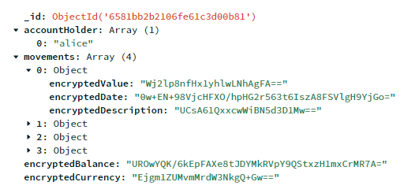
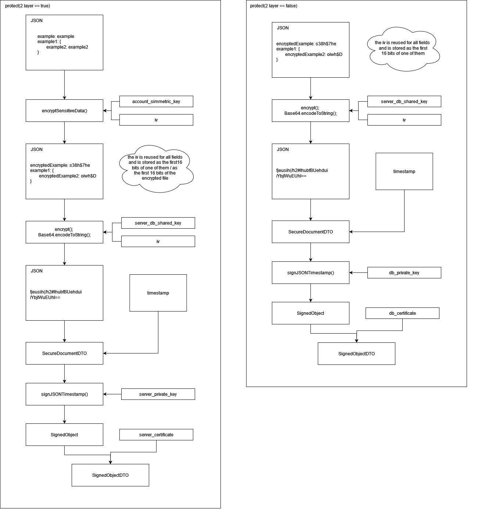
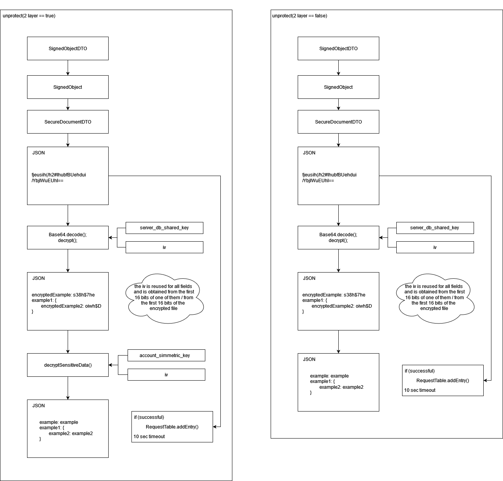
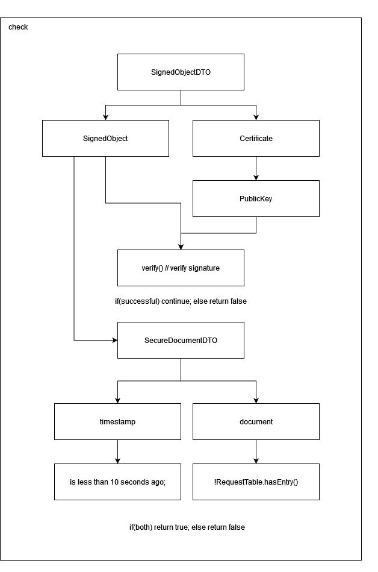
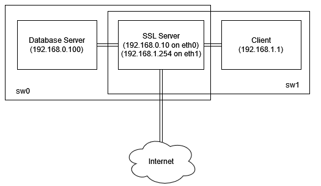
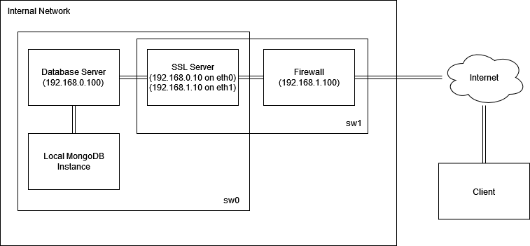

#  BlingBank

## 1. Introdução
  &emsp;O banco digital BlingBank destaca-se como um símbolo de acessibilidade e conveniência. A nossa plataforma bancária online capacita os utilizadores com funcionalidades robustas, tais como monitorização de despesas e pagamentos, verificação de saldo, execução de pagamentos e movimentos através de contas singulares e partilhadas. Para reforçar a segurança dos dados financeiros dos nossos utilizadores, desenvolvemos um projeto meticulosamente concebido para garantir os princípios de confidencialidade, integridade (inclusive deteção e respetiva rejeição de pagamentos que representem replay attacks), autenticidade e não repúdio para todas as transações.

&emsp;O nosso desafio de segurança primordial centra-se na implementação de medidas rigorosas para garantir a atualidade das ordens de pagamento, mitigando o risco de execuções duplicadas. Cada transação deve ser um registo irrefutável, impedindo qualquer repúdio de ações. Além disso, para contas com vários titulares, é necessária uma abordagem mais exigente, requerendo autorização e não repúdio de todos os titulares de conta antes de executar uma ordem de pagamento.

&emsp;Para atender a estes padrões de segurança elevados, reconhecemos a necessidade de duas bibliotecas criptográficas. Como explicitado no enunciado, assumimos a existência de chaves simétricas entre Banco e Cliente. Dada a necessidade de criação do par de chaves pública/privada para cada cliente (por dispositivo diferente), tal incluiu o desenvolvimento de novas chaves para os utilizadores, garantindo uma distribuição dinâmica de chaves que esteja alinhada com o nosso compromisso de proteger a integridade financeira e a confiança dos nossos utilizadores.

_Diagramas representativos são demonstrados abaixo aquando a parte relativa a estes esteja a ser abordada._

## 2. Project Development

### 2.1. Secure Document Format

#### 2.1.1. Design
A biblioteca criptográfica foi projetada para atender às exigências especificadas no cenário de negócios da BlingBank, que se concentra em garantir a confidencialidade, autenticidade e não repúdio das transações financeiras. Abaixo, um esboço do design, destacando as principais escolhas e respetivas justificações:<br>
#### - Estrutura Hierárquica do Documento:
&emsp;Primeiramente, definiu-se como formato de documento o tipo JSON, de forma a representar as diferentes informações de uma conta bancária, como titulares, saldo, movimentos e detalhes de pagamento. Ainda que cifrado, o documento é armazenado na Base de Dados na forma:



&emsp;Como verificável na imagem acima, o Secure Document é mantido num estado cifrado, mas mantendo a estrutura original concebida. De notar que apenas o atributo accountHolder tem valor não cifrado, esta escolha tem fundamento na possibilidade de execução de queries à Base de Dados a partir do valor associado a este atributo.

#### - Criptografia em Duas Camadas:
&emsp;A opção de criptografia em duas camadas é introduzida de forma a garantir as propriedades de segurança até aqui prometidas. Mais precisamente, esta permite, primeiramente, a criptografia individual dos atributos que compõem o ficheiro responsável pelo armazenamento de dados (à exceção do atributo accountHolder), ainda antes de realizar a criptografia completa do documento (segunda camada de cifra a executar). 

&emsp;Esta abordagem é útil e foi concebida para que, na troca de informações entre Servidor e Base de Dados (e vice-versa), a autenticidade do emissor seja verificada, mas os respetivos valores não possam ser acessíveis. Mais precisamente, caso a opção de twoLayerEncryption seja ativada, os valores dos atributos do documento são cifrados com a chave simétrica associada à respetiva conta do cliente e, posterirormente, os bytes relativos ao documento cifrado (primeira camada, onde, no ficheiro JSON, key é mantido em claro, mas value é cifrado) são, uma segunda vez, cifrados, mas agora, a partir da chave simétrica conhecida apenas pelo Servidor e Base de Dados. A ideia é que, no processo de decifra, do lado da Base de Dados, apenas seja possível decifrar a primeira camada, mantendo a confidencialidade dos valores armazenados (cifrados com a chave de conta, desconhecida pela Base de Dados). Já do lado do Servidor, este tem a capacidade de fazer a decifra das duas camadas, de modo a que seja possível processar certas operações lógicas necessárias.
Esta medida garante confidencialidade.

#### - Assinatura:
&emsp;Incluiu-se a assinatura do documento cifrado a partir de chaves assimétricas, mais precisamente, dependendo do emissor (Servidor ou Base de Dados), este é assinado com a chave privada do próprio. Assim, aquando receção do documento, o recetor passa a ter capacidade de verificar a assinatura com base na chave pública correspondente ao certificado do emissor presente na sua truststore.

&emsp;De forma a garantir freshness, evitando assim ataques de replay, ao documento assinado é lhe associado um valor TimeStamp para que, aquando receção do documento, possa ser feita uma verificação de já existência deste. Mais exatamente, na receção, é feita uma primeira verificação que consiste em descartar payloads com um valor TimeStamp associado de há mais de dez segundos comparativamente ao instante atual da máquina a executar o processo de verificação. Esta flexibilidade/gap temporal existe na medida de precaver possíveis dessincronizações de relógios entre máquinas em comunicação. Caso a TimeStamp associada esteja dentro do intervalo aceitável, é feita uma segunda verificação, agora numa tabela que guarda os últimos payloads recebidos nos últimos, também, dez segundos. Caso o mesmo payload se encontre na tabela, este é rejeitado, caso contrário, é aceite, processado e adicionado à tabela. Esta medida garante autenticidade.

<br>

#### 2.1.2. Implementation
&emsp;Nesta seção, discutiremos as escolhas de implementação fundamentais que orientam o desenvolvimento da biblioteca criptográfica. Cada decisão será cuidadosamente justificada com base nos requisitos específicos do cenário de negócios em questão. Foi utilizada a linguagem Java para o desenvolvimento da biblioteca.

&emsp;Primeiramente, de forma a construir uma instância de SecureDocumentLib, são necessários três argumentos, dos quais, keyStoreName, keyStorePass, keyStorePath. Estes representam o conjunto de variáveis necessárias para a garantia de acesso à keystore necessária, no caso, a keystore que contém as chaves a serem utilizadas no processo de cifra e decifra de documentos.

&emsp;Relativamente ao processo de cifra de documentos (método protect), este funciona da forma: é inicialmente verificado se a cifra é de uma, ou duas camadas. De notar que o Servidor executa sempre cifra de duas camadas, enquanto a Base de Dados executa sempre a cifra de apenas uma camada, a mais exterior (a ser explicado abaixo). Caso estejamos perante o caso de dupla cifra, é feita uma segunda verificação, desta vez, relativamente ao tipo de documento a cifrar, mais precisamente, este pode tratar-se de um documento de conta (geral), ou de um documento relativo aos pagamentos associados a uma dada conta (relativo ao documento do security challenge). Esta distinção deve-se à característica fundamental da opção de dupla cifra, já que, nesse caso, os valores associados às chaves do ficheiro JSON são cifrados individualmente o que, naturalmente, obriga a uma distinção, dada a diferença dos atributos que compõem cada ficheiro JSON. 

&emsp;De forma a cifrar os valores associados às keys do ficheiro JSON a ser protegido (à exceção do valor associado à key accountHolder, já explicado acima), é, inicialmente, obtida a chave simétrica associada à conta em questão, esta apenas conhecida entre utilizadores de conta e o próprio banco. Esta encontra-se guardada na keystore do Servidor (assumido pelo enunciado). Uma vez na posse da chave simétrica, é iniciado, de facto, o processo de cifra. Para tal, foi utlizado o algoritmo AES em modo CBC (Cipher Block Chaining) com preenchimento PKCS5Padding. A justificação do uso deste algoritmo advém de vários fatores, dos quais, resistência a padrões repetitivos, dado o uso de IV; É, também, oferecido por este uma segurança adicional, na medida em que o mesmo incorpora o bloco cifrado anterior no processo de encriptação do bloco atual, adicionando uma camada adicional de complexidade. Importante ter em conta que, devido a esta característica, o processo de cifra é sujeito a que, caso ocorra um erro num dado bloco, todos os blocos subsequentes sejam afetados por tal. Mais, tal característica impossibilita a paralelização deste processo, contudo, pelo enorme requisito de necessidade de segurança dos dados em questão, é algo que concordámos suportar. Abaixo, segue o processo em mais detalhe.
- Geração de IV (Initialization vector):
  - Um Initialization vector (IV) é gerado aleatoriamente com 16 bytes de comprimento. Este é essencial para garantir que textos idênticos não resultem em cifras idênticas, o que, consequentemente, aumenta a segurança do processo, principalmente contra ataques de análise.

  - Execução da cifra em cada valor associado a uma key do JSON. Este valor cifrado (bytes) é, noutra camada, codificado em Base64 e armazenado no valor do respetivo atributo associado ao objeto JSON a cifrar.
  
  - Concatenação do valor correspondente ao IV a um valor do documento:
    - O IV e o valor balance associado à conta (já cifrado com este algoritmo) são concatenados. Esta concatenação tem como intuito facilitar a transmissão e o armazenamento do IV junto com o conteúdo cifrado (Nota: para os ficheiros relativos aos pagamentos, o valor do IV é concatenado ao atributo encryptedPaymentNumbers).

  Com isto, dá-se o fim da cifra de primeira camada (interior).

<br>

&emsp;Relativamente à segunda camada, esta utiliza exatamente o mesmo algoritmo de cifra abordado anteriormente, pelas mesmas justificações. Contudo, neste caso, o processo de cifra é aplicado aos bytes relativos ao objeto JSON onde, neste, já terá sido aplicada a primeira camada de cifra. Importante referir que a chave simétrica utilizada para este processo é a conhecida entre Servidor e Base de Dados, apenas. Até este ponto, garantiu-se a propriedade de confidencialidade. 

&emsp;Relativamente às restantes propriedades pretendidas, estas foram obtidas da seguinte forma: 

 &emsp; Primeiramente, é verificado, a partir dos atributos relacionados à keystore - pertencentes à instância SecureDocumentLib em uso, quem está a executar o processo de cifra (Servidor ou Base de Dados), consoante tal, é obtida, a partir da sua respetiva keystore, a chave (assimétrica) privada deste. 
 
 O objetivo deste procedimento é garantir a propriedade de autenticidade, da forma: dado o objeto cifrado + codificado em Base64 e uma TimeStamp (a do exato momento da execução), estes permitem construir uma instância de um SecureDocumentDTO onde, consequentemente, é assinado a partir da chave privada obtida anteriormente. Mais precisamente, é utilizada a classe Signature da linguagem Java, a partir da criação de uma instância “SHA256withRSA”. A escolha do algoritmo "SHA256withRSA" baseou-se na necessidade de utilização do algoritmo de hash SHA-256, de forma a gerar um resumo criptográfico dos dados e, em seguida, assinar esse resumo a partir da chave privada RSA. Esta decisão deve-se muito ao facto do algoritmo de hash utilizado ser considerado um dos mais seguros atualmente, dada a sua grande capacidade de prevenção de tentativas de “reverse back” dos valores originais e, também, devido à sua resistência a colisões. De notar que a cifra utilizada a partir da chave assimétrica apenas executa sobre um digest, ou seja, apenas é aplicada sobre um pequeno payload, não interferindo drasticamente com a performance do programa. 
 
 A manipulação de chaves privadas requer um cuidado e proteção adequada, uma vez que o comprometimento da chave privada comprometeria a segurança do processo de assinatura. O resultado final é um objeto assinado digitalmente que pode ser transmitido ou armazenado com a garantia de integridade e autenticidade dos dados contidos no objeto original. Recapitulando, uma instância SecureDocumentDTO é assinada da forma abordada acima e, consequentemente, adicionada a uma, outra, instância SignedObjectDTO, composta pelo objeto assinado e respetivo certificado referente à chave privada usada na assinatura. Esta decisão tem fundamento na necessidade de obtenção do certificado, de modo a ser possível executar o método check (também presente na biblioteca) com fim a verificar a integridade e autenticidade do objeto assinado. O valor Timestamp presente no objeto SecureDocumentDTO será explicado abaixo, aquando menção do método check. Abaixo um diagrama representativo do método protect.

<br>



<br>
 &emsp;Relativamente ao método unprotect, este, naturalmente, executa o processo reverso do método protect. Contudo será importante referir alguns detalhes mais característicos deste, como a necessidade de extração dos primeiros 16 bytes referentes ao valor do IV (128 bits para o modo de operação CBC (Cipher Block Chaining), necessário para o processo de decifra. E, caso se trate de decifra de duas camadas, é executado o mesmo processo, mas agora retirando os 16 bytes relativos ao IV, do valor do atributo balance (no caso do ficheiro ser do tipo account) e, consequentemente, já com tudo o necessário, finalmente, executar o processo de decifra, individualmente, para cada valor. À medida que os valores são decifrados, o objeto JSON é construído com os respetivos valores em claro.

<br>



<br>
 &emsp;Por fim, será importante abordar o método check, este tem como papel principal verificar a integridade de um dado payload, mais precisamente, verificar a assinatura digital de um SignedObject e validar a TimeStamp associada a esse. Abaixo seguem os detalhes sobre os métodos utilizados, as bibliotecas envolvidas e as justificações para essas escolhas. Utilização de SHA256withRSA por razões relativas à decisão tomada no método protect. 
 
 &emsp;Foi utilizada a função verify, chamada no objeto signedObject, pertencente à instância signedObjectDTO, com a chave pública contida no certificado, também pertencente à instância signedObjectDTO. Tal procedimento verifica se a assinatura digital é válida, ou seja, se o payload não foi alterado e se este foi assinado pela entidade correspondente à chave privada associada à chave pública contida no certificado. Se tal se verificar, é ainda realizada uma segunda verificação, esta consiste em, finalmente, utilizar o valor TimeStamp associado ao SecureDocumentDTO, mais exatamente, verificar se o timestamp associado ao documento é válido, ou seja, se não expirou e se não foi anteriormente processado. Portanto, verifica se esse valor de TimeStamp já ultrapassa dez segundos comparativamente ao instante atual da execução (valor alargado, mas neste é tido em conta possíveis dessincronizações de relógio entre máquinas em comunicação – basicamente trata-se do limite de tempo em que um payload pode demorar a ser comunicado a partir da máquina Cliente até à sua receção na máquina Servidor), se sim, o payload é descartado, caso contrário, é feita uma nova verificação num HashSet, mais precisamente, este composto pelas entradas recebidas nos últimos dez segundos, ou seja, uma entrada apenas permanece neste Set por dez segundos, sendo que tal, tem como objetivo suprimir o tempo necessário para realizar esta nova verificação, evitando assim uma possível extensibilidade absurda deste. Caso já exista uma entrada correspondente no Set, este é invalidado, caso contário, validado. Esta medida tem como principal fundamento a prevenção de replay attacks.

<br>



<br>
 &emsp;No âmbito da implementação da biblioteca criptográfica, destacamos a prática consistente de utilizar o método protect no servidor, ativando a cifra dupla por meio da flag correspondente. Essa prática visa garantir a confidencialidade dos dados ao armazená-los na base de dados, onde a decifra dupla é desativada durante a operação unprotect. Essa abordagem estratégica assegura que a camada interna, contendo informações sensíveis, permaneça opaca para a base de dados, preservando a confidencialidade dos dados cifrados. Um aspeto crucial é a assinatura da cifra exterior, introduzindo um mecanismo robusto de autenticação. A assinatura, realizada durante o processo de proteção, permite a verificação eficaz da autenticidade dos dados aquando execução do método unprotect. Ao empregar a assinatura digital, criamos uma camada adicional de segurança, assegurando que a integridade, autenticidade e não repúdio dos dados seja verificada, mesmo quando são manipulados em diferentes partes do sistema.


### 2.2. Infrastructure
aaaaaaaaaaaaaa
#### 2.2.1. Network and Machine Setup
A configuração de rede e máquinas desempenha um papel fundamental na infraestrutura do projeto, estabelecendo as bases para a comunicação segura entre as entidades envolvidas. Nesta seção, descreveremos sucintamente a topologia adotada, destacando a disposição das máquinas e as configurações de rede específicas para cada uma.
A infraestrutura é composta por 3 máquinas:

- Cliente (VM3)
- Servidor SSL (VM2)
- Servidor BD (VM1)

E reflete a estrutura dada na componente laboratorial da disciplina. As máquinas são ligadas por switches a pares (VM1, VM2) e (VM2, VM3), sendo que apenas a VM2 tem ligação à internet.
Esta estrutura foi usada pois não conseguimos criar uma Base de Dados MongoDB local, pelo que o servidor BD iria necessitar de ligação à internet (possível vulnerabilidade)

--------------------------------------------

À VM1 foi atribuído o endereço IP 192.168.0.100, através do comando:

```sh
sudo ifconfig eth0 192.168.0.100/24 up
```

Foi configurada para usar a VM2 como gateway com os seguintes comandos:

```sh
sudo ip route add default via 192.168.0.10
echo 'nameserver 8.8.8.8' >> /etc/resolv.conf
```

E foi adicionada uma firewall:

```shell
# regras default
#sudo iptables -P INPUT DROP
sudo iptables -P FORWARD DROP
# permitir ligacao ao mongoDB
sudo iptables -A INPUT -p tcp --dport 27017 -j ACCEPT
# permitir ligacao ao server
sudo iptables -A INPUT -p tcp --dport 54321 -s 192.168.0.10 -j ACCEPT
```
A primeira regra encontra-se desativada de forma a conseguir aceder a outros serviços externos usados durante o desenvolvimento (e.g. Maven)

--------------------------------------------

À VM2 foi atribuído o IP 192.168.0.10 na interface eth0 e o 192.168.1.254 na interface eth1, através dos seguintes comandos:

```sh
sudo ifconfig eth0 192.168.0.10/24 up
sudo ifconfig eth1 192.168.1.254/24 up
```
Foi ainda configurada para atuar como gateway das VM1 e VM3 com os comandos:

```sh
sudo sysctl net.ipv4.ip_forward=1
sudo iptables -P FORWARD ACCEPT
sudo iptables -F FORWARD
sudo iptables -t nat -F
sudo iptables -t nat -A POSTROUTING  -o eth2 -j MASQUERADE
```

Por fim, adicionou-se uma simples firewall:

```shell
# regras default
#sudo iptables -P INPUT DROP
# apenas permitir ligacoes no porto correto
sudo iptables -A INPUT -p tcp --dport 12345 -j ACCEPT
# ou da database
sudo iptables -A INPUT -p tcp -s 192.168.0.100 -j ACCEPT
```
Que apenas permite ligações no porto correto. A primeira regra encontra-se desativada de forma a conseguir aceder a outros serviços externos usados durante o desenvolvimento (e.g. Maven)

--------------------------------------------

À VM3 foi atribuído o endereço IP 192.168.1.1, através do comando:

```sh
sudo ifconfig eth0 192.168.1.1/24 up
```

E foi configurada para usar a VM2 como gateway com os seguintes comandos:

```sh
sudo ip route add default via 192.168.1.254
echo 'nameserver 8.8.8.8' >> /etc/resolv.conf
```



(_Provide a brief description of the built infrastructure._)

(_Justify the choice of technologies for each server._)

#### 2.2.2. Server Communication Security
Comunicação segura é uma parte vital da arquitetura de segurança, assegurando a troca de dados confidenciais entre entidades, incluindo comunicações Cliente <-> Servodor e Servidor-Base de Dados. A nossa implementação adota uma abordagem baseada em sockets SSL (Secure Sockets Layer) para garantir as propriedades de segurança pretendidas perante as informações a serem transmitidas. Abaixo, descrevemos as estratégias e desafios associados a esta implementação.
Primeiramente, é de grande relevância relatar o trabalho de administrador de sistemas que será necessário executar, de modo a obter o bom funcionamento do sistema. Mais precisamente, foi necessário executar as seguintes ações: (Nota: tal trata-se de um trabalho ao encargo de um administrador de sistemas, onde este o executa excecionalmente, numa fase prévia ao respetivo deployment da aplicação)
Foi utilizada a ferramenta de gestão de chaves e certificados, parte do JDK, keytool.
(SERVIDOR)
1 – Gerar Keystore do Servidor juntamente com a geração do par de chave pública e privada RSA do mesmo
- keytool -genkeypair -alias serverRSA -keyalg RSA -keysize 2048 -storetype PKCS12 -keystore serverKeyStore
  2 – Extrair o Certificado associado à chave pública do Servidor
  - keytool -exportcert -alias serverrsa -storetype PKCS12 -keystore serverKeyStore -file serverCert.cer
  2.1 – Este Certificado é guardado num diretório denominado CAserver, de forma a simular uma Certification Authority, ou seja, este pode ser considerado um certificado de confiança.
  3 – Gerar Truststore do Servidor vazia (necessário iniciar com uma chave, mas é apagada de seguida)
  - keytool -genseckey -alias toDeleteKey -keyalg AES -keysize 256 -storetype PKCS12 -keystore serverTrustStore
- keytool -delete -alias toDeleteKey -storetype PKCS12 -keystore serverTrustStore
  4 – Gerar chaves simétricas assumidas pelo enunciado. Existência de uma por conta, apenas conhecida por Cliente + Dispositivo e Servidor. Utilizadas na comunicação Cliente <-> Servidor. Exemplo de geração:
  - keytool -genseckey -alias alice_iphone_secret -keyalg AES -keysize 256 -storetype PKCS12 -keystore serverKeyStore
- keytool -genseckey -alias alice_computador_secret -keyalg AES -keysize 256 -storetype PKCS12 -keystore serverKeyStore
  5 – Uma vez assumido o conhecimento de chaves simétricas entre Cliente e Banco, foram, também, previamente geradas as chaves simétricas associadas à conta e não ao Cliente + dispositivo. Mais precisamente, cada conta terá uma chave simétrica conhecida apenas pelo Servidor e Base de Dados, de forma a habilitar a comunicação segura entre estes. Exemplo de geração:
  - keytool -genseckey -alias alice_account_secret -keyalg AES -keysize 256 -storetype PKCS12 -keystore serverKeyStore
    (Para contas partilhadas)
-	keytool -genseckey -alias alice_bob_account_secret -keyalg AES -keysize 256 -storetype PKCS12 -keystore serverKeyStore
     6 – Gerar e adicionar chave simétrica conhecida entre Servidor e Base de Dados à Keystore do Servidor.
     - keytool -genseckey -alias server_db_secret -keyalg AES -keysize 256 -storetype PKCS12 -keystore serverKeyStore

(Base de Dados)
7 - Gerar Keystore da Base de Dados juntamente com a geração do par de chave pública e privada RSA do mesmo.
- keytool -genkeypair -alias dataBaseRSA -keyalg RSA -keysize 2048 -storetype PKCS12 -keystore dataBaseKeyStore
8 - Extrair o Certificado associado à chave pública da Base de Dados
- keytool -exportcert -alias databasersa -storetype PKCS12 -keystore dataBaseKeyStore -file dataBaseCert.cer
9 - Copiar chave simétrica server_db_secret para Keystore (realizado em tempo de execução, não realizado pelo administrador de sistemas, mas importante fazer referência, também, aqui. A ser abordado mais à frente).
10 - Gerar Truststore da Base de Dados vazia (necessário iniciar com uma chave, mas é apagada de seguida)
- keytool -genseckey -alias toDeleteKey -keyalg AES -keysize 256 -storetype PKCS12 -keystore dataBaseTrustStore
- keytool -delete -alias toDeleteKey -storetype PKCS12 -keystore dataBaseTrustStore
  11 - Importar certificado da Base de Dados para a TrustStore do Servidor
  - keytool -importcert -alias databasersa -file ../../DataBase/dataBaseKeyStore/dataBaseCert.cer -storetype PKCS12 -keystore serverTrustStore
  12 - Importar certificado do Servidor para a TrustStore da Base de Dados
  - keytool -importcert -alias serverrsa -file ../../CAserver/serverCert.cer -storetype PKCS12 -keystore dataBaseTrustStore

Posto isto, é agora importante realçar o porquê das escolhas tomadas. A decisão de utilizar a ferramenta keytool para a geração de chaves simétricas e assimétricas é respaldada por diversos motivos que contribuem para a segurança e interoperabilidade do sistema. Para chaves assimétricas, utilizou-se o algoritmo RSA, sendo este amplamente utilizado para criptografia assimétrica, acabando por oferecer robustez em termos da obtenção de uma comunicação segura entre entidades. O tamanho de 2048 bits é considerado seguro e é uma escolha comum para aplicações que exigem um equilíbrio entre segurança e desempenho. Relativamente às chaves simétricas, foi utilizado o algoritmo AES com 256 bits, pelos mesmos motivos anteriormente referidos. A escolha do formato PKCS12 para armazenamento de chaves no sistema foi fundamentada em benefícios significativos como portabilidade, já que se trata de um formato amplamente aceite, proporcionando portabilidade e interoperabilidade além do ecossistema Java. Este também suporta o armazenamento de diferentes dados de segurança e define a necessidade de autenticação, via password, de forma aceder ao seu conteúdo.
Com isto, dá-se por concluído o trabalho inicial do admnistrador de sistemas.

Passando agora à explicação da implementação do código-fonte responsável por, em conjunto com os SSL Sockets, assegurar a confidencialidade, integridade e autenticidade das informações transmitidas. A classe SecureMessageLib desempenha um papel crucial na garantia de comunicações seguras sobre sockets SSL. Os principais aspetos da implementação:
- Cifragem de Mensagens: o método protectMessage é responsável por cifrar uma mensagem antes de ser enviada. Utiliza uma chave secreta compartilhada entre duas entidades apenas, obtida a partir de uma keystore segura. A cifragem é realizada com o algoritmo AES em modo CBC (Cipher Block Chaining), de forma a garantir confidencialidade (decisão com o mesmo fundamento anteriormente apresentado). De forma a garantir integridade e autenticidade da mensagem a ser transmitida, é feita uma assinatura, a partir da chave privada do emissor em questão, aos dados cifrados (ou melhor, ao hash dos dados cifrados). Esta é, consequentemente, concatenada a estes para posterior verificação. Posto isto, é feita a codificação para Base64 dos dados em questão.
- Verificação de Assinatura Digital: O método unprotectMessage decifra e autentica mensagens recebidas. Este divide a mensagem recebida em duas partes, as quais, a com o conteúdo cifrado, e a com a respetiva assinatura. Primeiramente, verifica-se a integridade e autenticidade dos dados recebidos, a partir do método Signature.verify, onde este verifica a assinatura digital utilizando a chave pública do remetente, garantindo assim as propriedades pretendidas, inclusive o não-repúdio. Caso seja verificado, é então feita a decifra dos dados (com tudo o que essa ação implica, extração de IV, etc. – já explicado na secção 2.1.2).
Nota: Foi utilizada a mesma lógica e algoritmos de cifra, decifra, IV e assinatura nas duas libs desenvolvidas, daí a carência de detalhe nesta secção.

Agora, individualmente, serão expostas as diferentes abordagens tidas para com as diferentes entidades comunicadoras.
- Comunicação Servidor <-> Base de Dados: a Base de Dados disponibiliza um SSL Socket, configurado com a sua respetiva Keystore, de forma a autenticar-se perante quem se conecta a este. Para tal, utilizou-se System.setProperty("javax.net.ssl.keyStoreType", "PKCS12"); System.setProperty("javax.net.ssl.keyStore", keyStorePath); System.setProperty("javax.net.ssl.keyStorePassword", keyStorePass);. No contexto da comunicação com a base de dados, o servidor adota uma abordagem segura ao incorporar um SSL Socket, estabelecendo assim uma conexão protegida. Este mecanismo essencial garante não apenas a confidencialidade, mas também a integridade e autenticidade das transmissões de dados. Para possibilitar essa comunicação segura, são empregadas propriedades fundamentais, nomeadamente, Keystore e Truststore. A Keystore é utilizada pelo servidor para se autenticar perante a Base de Dados, enquanto a Truststore desempenha um papel crucial ao verificar a autenticidade da fonte de dados da base de dados. Noutras palavras, a Truststore valida se a Base de Dados é uma fonte confiável, proporcionando assim uma camada adicional de segurança. Uma vez que o estabelecimento desta comunicação necessita da autenticação por parte das duas entidades envolventes, o Servidor necessita, ao conectar-se, de enviar o seu respetivo Certificado, bem como o HMAC do mesmo, calculado a partir da chave simétrica conhecida apenas pelo Servidor e Base de Dados (Nota: referir que esta chave simétrica é inserida na Keystore da Base de Dados em tempo de execução, aquando executado o código-fonte relativo ao Servidor, uma vez que tal não foi realizado em trabalho de administrador de sistemas, por falta de capacidades). Tanto o Certificado, como o respetivo HMAC deste, são enviados em claro, através do SSL Socket, uma vez que apenas se pretende obter a propriedade de integridade no envio deste, já que se trata de um identificador público, conhecido por todos. Uma vez recebidos, a Base de Dados encarrega-se de verificar a integridade do certificado, comparando o resultado relativo ao HMAC recebido, com o calculado por si, a partir da chave simétrica alocada na sua keystore (apenas conhecida por esta e pelo Servidor). Se for verificado, este compara o certificado recebido com o único certificado que contém na sua Truststore, no caso, o referente ao Servidor. Após tal procedimento, para qualquer troca de ficheiros entre as entidades envolventes, é utilizada a biblioteca SecureDocumentLib, de forma a proteger/desproteger o ficheiro JSON a ser transmitido. Consequentemente, este é codificado/descodificado em Base64 e, posteriormente, protegido/desprotegido através da utilização da biblioteca SecureMessageLib. Já a troca de mensagens, mais precisamente, quando não são transmitidos ficheiros, mas apenas pedidos/informações apenas é utilizada a biblioteca SecureMessageLib.

- Comunicação Cliente <-> Servidor: O Servidor disponibiliza um SSL Socket, configurado com a sua respetiva Keystore, de forma a autenticar-se perante quem se conecta a este. Para tal, utilizaram-se as propriedades semelhantes às já referidas acima. No contexto da comunicação com o Servidor, o Cliente adota uma abordagem segura ao incorporar um SSL Socket, estabelecendo assim uma conexão protegida. Antes da conexão ser estabelecida, é verificado se o Cliente se encontra a conectar-se num dispositivo novo. Se sim, são geradas, em tempo de execução, as chaves RSA correspondentes a este novo dispositivo. Estas são guardadas na sua respetiva keystore (numa pasta segura do dispositivo, sem acessos partilhados). Depois, novamente em tempo de execução, é, também, inserida a chave simétrica (associada ao novo dispositivo) conhecida apenas entre o Cliente + dispositivo e Servidor na respetiva keystore. Consequentemente, é criada a Truststore do Cliente, onde nesta é importado o Certificado do Servidor, presente no diretório CA, simulando um certificado autenticado por esta. Posto isto, é aplicada uma lógica semelhante à acima abordada relativamente ao processo de envio do certificado e respetivo cálculo de HMAC, a partir da chave simétrica conhecida pelo Cliente e Servidor apenas, para o Servidor. Mais precisamente, o Cliente envia-os e, aquando receção, o Servidor faz a verificação de integridade já explicada anteriormente. Caso seja verificada a integridade do certificado, este é guardado na Truststore do Servidor para futuras verificações relacionadas com assinaturas. Após este procedimento, ou caso não seja um novo dispositivo, é procedida a comunicação entre as duas entidades através da biblioteca SecureMessageLib, mais exatamente, todos os pedidos e respostas são protected/unprotected através dos métodos já explicados acima.
  Em conclusão, a implementação efetiva destas práticas de segurança possibilitou a criação de um ambiente robusto e confiável, essencial para proteger a confidencialidade, integridade, autenticidade e não repúdio das informações transmitidas em ambas as direções: Servidor <-> Base de Dados e Cliente <-> Servidor.

(_Discuss how server communications were secured, including the secure channel solutions implemented and any challenges encountered._)

(_Explain what keys exist at the start and how are they distributed?_)

### 2.3. Security Challenge

#### 2.3.1. Challenge Overview & Solution Design and Implementation
O desafio de segurança proposto perpetuou a necessidade de assegurar confidencialidade, autenticidade, não repúdio e freshness nas transações associadas a um novo ficheiro (este tem como intuito armazenar pagamentos efetuados), além de exigir a implementação de uma distribuição dinâmica de chaves. Abaixo, descrevemos a solução implementada e seu impacto no sistema existente até esse momento.
- Distribuição Dinâmica de Chaves: o impacto desta exigência foi atenuado pela prática, já existente, de gerar um par de chaves público-privado para o Cliente durante a autenticação. Como abordado acima, o cliente envia o seu respetivo certificado, acompanhado do HMAC gerado a partir da chave simétrica compartilhada entre, apenas, Cliente e Servidor, permitindo que o Servidor verifique a integridade do Certificado recebido. Este processo garante uma distribuição segura e dinâmica de chaves ou, no caso, do Certificado associado à chave pública, estabelecendo uma base sólida para as operações subsequentes.
- Confidencialidade, Autenticidade e Não Repúdio: a biblioteca SecureMessageLib, já incorporada no sistema, desempenhou um papel crucial na garantia de confidencialidade, autenticidade e não-repúdio das transações. Ao cifrar e assinar as mensagens trocadas entre Cliente e Servidor, a SecureMessageLib oferece uma camada de proteção robusta contra acesso não autorizado e garante a autenticidade das partes envolvidas.
- Freshness: para assegurar freshness, foi implementado um novo processo. Ao solicitar um pagamento, o Cliente inicia a comunicação com o Servidor, que responde enviando um nonce (no caso, uma TimeStamp). O cliente, por sua vez, responde com o pedido de execução de pagamento cifrado e assinado, incorporando neste o nonce recebido. Do outro lado, o servidor, aquando receção, verifica a assinatura e, posteriormente, verifica se o nonce recebido está de acordo com o enviado. Se sim, este verifica se o payload recebido já se encontra em alguma entry de uma tabela de pedidos armazenada por este (Nota: esta tabela tem a mesma lógica da já abordada mais acima, mais precisamente, trata-se de um Set que contém entradas relativas a payloads recebidos nos últimos dez segundos). Caso já exista uma entry com o mesmo valor, o pedido é descartado, caso contrário o pedido de pagamento é executado.

Relativamente ao processo de pagamento aquando executado em contas partilhadas, ou seja, com múltiplos utilizadores, este tem a particularidade de, quando realizado, permanecer pendente aguardando confirmação dos restantes utilizadores de conta. Tal foi implementado através de uma tabela auxiliar, guardada em memória não persistente, onde esta guarda os pedidos de pagamento referentes a contas partilhadas ainda não confirmados por todos os utilizadores de conta. Mais precisamente, nesta tabela, é guardado o pedido de pagamento, juntamente com o ID da transação e os respetivos utilizadores por confirmar. Deste modo, foram adicionadas duas novas funcionalidades, as quais, verificar pagamentos pendentes e confirmar pagamentos pendentes. Relativamente à funcionalidade de verificar pagamentos pendentes, a sua implementação baseou-se em obter os pedidos de pagamento contidos na tabela que o Cliente em causa tem por confirmar. Já a confirmação do pagamento baseia-se no Cliente enviar uma mensagem ao Servidor confirmando o pedido de pagamento através do ID da transação em questão, sendo por tal, removido da lista de utilizadores por confirmar. Quando esta lista se torna vazia, ou seja, aquando última confirmação, o pedido de pagamento é, de facto, executado. Todos estes pedidos são protegidos e desprotegidos utilizando a biblioteca SecureMessageLib, garantindo confidencialidade, integridade, autenticidade e não repúdio.

(_Describe the new requirements introduced in the security challenge and how they impacted your original design._)

#### 2.4. Attacker Model
O sistema em questão apresenta uma robusta estrutura de segurança, com medidas que visam proteger os dados sensíveis e garantir a confidencialidade e autenticidade das transações. No entanto, uma análise mais detalhada destaca algumas considerações de segurança importantes:
- Acesso à Chave Privada dos Clientes: o atacante só pode exercer poder sobre o sistema se obtiver acesso à chave privada dos clientes. Mesmo com essa posse, a conexão bem-sucedida ao sistema depende do conhecimento do nome de utilizador associado à chave privada. Além disso, sem a chave simétrica compartilhada entre o Cliente e o Servidor, o atacante fica impedido de decifrar qualquer payload, dificultando a extração de informações valiosas.
- Acesso à Base de Dados: a segurança do acesso à base de dados é significativa. O atacante precisaria do certificado da Base De Dados, certificado do Servidor e a chave simétrica compartilhada entre Servidor e Base de Dados. Dada a natureza protegida do certificado da Base de Dados, obtido apenas por meio do administrador de sistemas e não disponível em locais públicos, torna-se uma tarefa desafiadora para um atacante obter todos os elementos necessários para se conectar à base de dados.
- Vulnerabilidades no Servidor: uma potencial vulnerabilidade destacada é a suscetibilidade a ataques de negação de serviço distribuídos (DDoS) e possíveis ataques de buffer overflow. Esses tipos de ataques podem visar tornar o servidor indisponível ou explorar falhas na gestão de buffers, representando uma ameaça à estabilidade do sistema.
  Em termos de classificação de confiança, ambos, o Servidor e a Base de Dados, são configurados para realizar uma ligação com autenticação bilateral (two-way authentication), o que significa que ambas as partes validam as suas identidades mutuamente. Este processo envolve a troca, via offline, de certificados e chaves simétricas para garantir a autenticidade e integridade da comunicação. Esta prática fortalece a confiança nas transações entre o Servidor e a Base de Dados, contribuindo para a classificação como totalmente confiáveis. Já o Cliente, este é classificado como parcialmente confiável, uma vez que a sua comunicação com o Servidor não é totalmente autenticada.

(_Define who is fully trusted, partially trusted, or untrusted._)

(_Define how powerful the attacker is, with capabilities and limitations, i.e., what can he do and what he cannot do_)


## 3. Conclusion
Em suma, ao analisarmos a implementação do sistema, destacam-se vários pontos positivos, mas também identificamos áreas que poderiam ser fortalecidas para garantir uma segurança mais robusta.
- Aspetos Positivos:
- Criptografia Robustas - A criptografia implementada nas comunicações através das bibliotecas SecureDocumentLib e SecureMessageLib demonstrou eficácia na garantia de confidencialidade, integridade, autenticidade e não repúdio dos dados transmitidos.
- Segurança na Comunicação Servidor <-> Base de Dados: a implementação da autenticação bilateral, com certificados para o Servidor e a Base de Dados, fornece uma camada sólida de confiança na identidade dessas entidades. O facto da troca de certificados e chave simétrica ser feito offline (no local físico), via um administrador de sistemas, torna, posteriormente, o processo de comunicação bastante seguro.
- Segurança na Comunicação Cliente-Servidor: o cálculo do HMAC relativo ao Certificado do Cliente no processo de envio ao Servidor é uma boa medida em termos da propriedade de segurança integridade (do certificado recebido).
- Caso o Cliente se conecte a partir de um novo dispositivo, são geradas e transmitidas, de forma segura, as chaves assimétricas necessárias, em tempo de execução.
- No caso do Security Challenge, a prevenção contra ataques de replay através da implementação desenvolvida também tende a ser um ponto positivo, já que esta é, de facto, útil.

  - Áreas de Aprimoramento:
    - Melhorias na Infraestrutura: considerando a infraestrutura ideal, a implementação local do MongoDB pode ser uma escolha sólida, proporcionando maior controlo sobre o armazenamento de dados sensíveis. Essa mudança pode fortalecer a segurança, uma vez que reduz as exposições a possíveis vulnerabilidades associadas ao armazenamento online.


A infraestrutura ideal seria composta por 3 máquinas internas, às quais se acresce a máquina do cliente, externa. Estas máquinas seriam:

- Cliente (VM1)
- Firewall (VM2)
- Servidor SSL (VM3)
- Servidor BD (VM4)

--------------------------------------------------

A VM1, por ser controlada pelo Cliente, não possui quaisquer restrições impostas pela aplicação nas suas ligações à rede.

--------------------------------------------------

A VM2 serve como fronteira para a rede interna. Está ligada através do switch sw1 á VM3, possuindo o IP 192.168.1.100 neste. Está ligada á internet num segundo adaptador. Este endereço foi atribuído com o comando:

```sh
sudo ifconfig eth1 192.168.1.100/24 up
```

Para permitir a redirecção de pacotes da rede interna para a internet executa-se:

```sh 
sudo sysctl net.ipv4.ip_forward=1
```

Quaisquer comunicações entre a rede interna e a internet são sujeitas às regras presentes nesta máquina, apresentadas a seguir:

```sh
# regras default
sudo iptables -P INPUT DROP
sudo iptables -P FORWARD DROP
sudo iptables -P OUTPUT ACCEPT

# redirecionar para o server
sudo iptables -A INPUT -p tcp --dport 12345 -j DNAT --to-destination 192.168.1.10:12345
# permitir pacotes de ligações prévias
sudo iptables -A INPUT -m conntrack --ctstate ESTABLISHED,RELATED -j ACCEPT
# permitir que forward de pacotes do server
sudo iptables -A FORWARD -p tcp --dport 12345 -d 192.168.1.10 -j ACCEPT
```

Estas regras permitem que o tráfego proveniente do servidor consiga passar para fora da rede. Por outro lado, no caso de tráfego proveniente da internet, este só pode entrar se for direcionado ao porto 12345, sendo então redirecionado para o IP correto do servidor (192.168.1.10). Ainda na VM2 é executado um script snort:

```
preprocessor frag3_global
preprocessor frag3_engine

var SSLSERVER 192.168.1.254

alert tcp any any -> $SSLSERVER 12345 (msg:"5 or more tcp connections from the same client were received in the last 60 seconds"; threshold : type both, track by_src, count 5, seconds 60; sid :10001)
```

Este script emite um alerta na consola caso sejam recebidas 5 ou mais tentativas de ligação tcp ao servidor num intervalo de 60 segundos, todas provenientes do mesmo cliente, o que pode indicar um ataque DDoS.

--------------------------------------------------

Na VM3 executa-se o servidor SSL no porto 12345. Esta máquina tem acesso á internet no switch sw1, mediado pela firewall, de forma a permitir a ligação de clientes remotos. Consegue também abrir ligações à VM4 no switch sw0. O seu IP nestes adaptadores foi atribuído com:

```sh
sudo ifconfig eth0 192.168.0.10/24 up
sudo ifconfig eth1 192.168.1.10/24 up
```

Foi configurada para usar a VM2 como gateway para a internet com:

```sh
sudo ip route add default via 192.168.1.100
echo 'nameserver 8.8.8.8' >> /etc/resolv.conf
```

E possui as seguintes regras iptables:

```sh
# regras default
sudo iptables -P INPUT DROP
sudo iptables -P FORWARD DROP
sudo iptables -P OUTPUT ACCEPT

# apenas permitir conexões no porto 12345
sudo iptables -A INPUT -p tcp --dport 12345 -j ACCEPT
```

Permitindo apenas conexões no porto 12345.

--------------------------------------------------


Por fim, a VM4 atua como servidor Base de Dados. Tem uma Base de Dados MongoDB local e apenas consegue comunicar com a VM3, não tendo acesso à internet. O seu IP foi definido com:

```sh 
sudo ifconfig eth0 192.168.0.100/24 up
```

E as suas regras são:

```
# regras default
sudo iptables -P INPUT DROP
sudo iptables -P FORWARD DROP
sudo iptables -P OUTPUT ACCEPT

# apenas permitir conexões do server
sudo iptables -A INPUT -s 192.168.0.10 -j ACCEPT
```

Permitindo apenas conexões com origem no servidor SSL. Em seguida encontra-se um diagrama desta infraestrutura ideal:




- Aprimoramento nos Pagamentos Pendentes: uma área que merece atenção adicional é o tratamento de pagamentos pendentes (contas partilhadas). Uma abordagem mais segura seria armazenar esses pagamentos na Base de Dados, em vez de em memória volátil (no Servidor), de forma a garantir a permanência do seu armazenamento, ainda que o Servidor seja desligado.
- Desenvolvimento de mais features: Inicialmente, estariam planeadas desenvolver features como a capacidade de criação de novas contas, congelamento ou término destas, associação de um gestor de contas, alteração de um gestor de contas, devido a férias, por exemplo, etc. Contudo, dada a limitação de tempo imposta, tal não foi possível desenvolver. Contudo, por exemplo, para o desenvolvimento de um gestor de conta, o planeado teria sido: adicionar um atributo gestor de conta ao documento de cada conta, onde, caso este fizesse um pedido relativo a outra conta que não a do próprio, este novo campo seria verificado e, caso comprovado que o mesmo se tratasse efetivamente de um gestor de conta da conta em questão, o pedido seria processado e, intrinsecamente, o Servidor solicitaria o documento em questão, decifrá-lo-ia com a chave simétrica existente/conhecida apenas entre o mesmo e a Base de Dados e, posteriormente, tornaria a cifrá-lo, agora com a chave simétrica conhecida apenas entre o gestor de contas e Servidor.

Ao encerrarmos este projeto, é evidente que a experiência foi enriquecedora, proporcionando uma oportunidade única para explorar os desafios e avanços na implementação de práticas de segurança robustas. A jornada desde a conceção até à concretização do sistema não apenas consolidou conhecimentos, mas também destacou áreas cruciais para o aprimoramento contínuo da segurança informática.
O equilíbrio entre os pontos fortes do sistema e as oportunidades de melhoria delineia um caminho claro para futuras iterações que visem elevar ainda mais os padrões de segurança. Este projeto não só representa a aplicação prática de conceitos teóricos, mas também destaca a necessidade constante de adaptação às exigências em constante evolução do cenário de segurança informática. Assim, esta experiência não é apenas um marco na aplicação de conhecimentos, mas também uma base sólida para futuros desenvolvimentos que se alinhem com os mais elevados padrões de segurança.


(_State the main achievements of your work._)

(_Describe which requirements were satisfied, partially satisfied, or not satisfied; with a brief justification for each one._)

(_Identify possible enhancements in the future._)

(_Offer a concluding statement, emphasizing the value of the project experience._)

## 4. Bibliography
 - OpenAI, GPT-3.5, OpenAI Platform, Ano: 2023, URL: https://openai.com/chatgpt
 - António Casimiro, Alysson Bessani, Alan Oliveira; API segurança do Java - Chaves assimétricas (e keytool); 2022; PowerPoints disponiblizados via platforma académica Moodle da Faculdade de Ciências da Universidade de Lisboa


----
END OF REPORT
